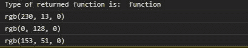
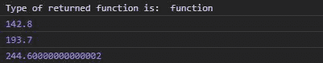
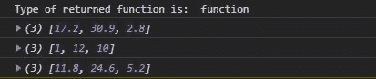

# d3 .插值()函数

> 原文:[https://www.geeksforgeeks.org/d3-interpolate-function/](https://www.geeksforgeeks.org/d3-interpolate-function/)

D3.js 中的**插值()**函数用于插值两个给定值。就颜色而言，它用于从给定的两种颜色中形成第三种颜色。

**语法:**

```
d3.interpolate(a, b);
```

**参数:**该功能接受两个参数，如上所述，描述如下。

*   **a:** 是任意值。
*   **b:** 是任意值。

**返回值:**返回一个函数。

**例 1:** 当给定颜色作为参数时。

## 超文本标记语言

```
<!DOCTYPE html>
<html lang="en">

<head>
    <meta charset="UTF-8">
    <meta name="viewport" content=
        "width=device-width, initial-scale=1.0">
</head>

<body>
    <!--fetching from CDN of D3.js -->
    <script type="text/javascript" 
        src="https://d3js.org/d3.v4.min.js">
    </script>

    <script>
        let intr = d3.interpolate("red", "green")
        console.log("Type of returned function is: ",
                typeof (intr));
        console.log(intr(0.1))
        console.log(intr(1))
        console.log(intr(0.4))
    </script>
</body>

</html>
```

**输出:**



**例 2:** 当给定数字作为参数时。

## 超文本标记语言

```
<!DOCTYPE html>
<html lang="en">

<head>
    <meta charset="UTF-8">
    <meta name="viewport" content=
        "width=device-width, initial-scale=1.0">
</head>

<body>
    <!--fetching from CDN of D3.js -->
    <script type="text/javascript" 
        src="https://d3js.org/d3.v4.min.js">
    </script>

    <script>
        let intr = d3.interpolate(41, 550)
        console.log("Type of returned function is: ",
                typeof (intr));
        console.log(intr(0.2))
        console.log(intr(0.3))
        console.log(intr(0.4))
    </script>
</body>

</html>
```

**输出:**



**例 3:** 当给定一个数组作为参数时:

## 超文本标记语言

```
<!DOCTYPE html>
<html lang="en">

<head>
    <meta charset="UTF-8">
    <meta name="viewport" content=
        "width=device-width, initial-scale=1.0">
</head>

<body>
    <!--fetching from CDN of D3.js -->
    <script type="text/javascript" 
        src="https://d3js.org/d3.v4.min.js">
    </script>

    <script>
        let intr = d3.interpolate(
            [19, 33, 2], [1, 12, 10])
        console.log("Type of returned function is: ",
                typeof (intr));

        console.log(intr(0.1))
        console.log(intr(1))
        console.log(intr(0.4))
    </script>
</body>

</html>
```

**输出:**

