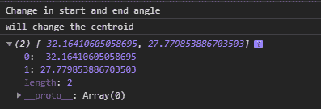

# D3.js 弧形心()功能

> 原文:[https://www.geeksforgeeks.org/d3-js-arc-centroid-function/](https://www.geeksforgeeks.org/d3-js-arc-centroid-function/)

**弧线形心()**功能用于计算弧线中心线的中点。生成的中点使用(起点角度+终点角度)/2 和(内半径+外半径)/2 计算。

**语法:**

```
arc.centroid(arguments);
```

**参数:**该函数接受一个参数，如上所述，如下所述。

*   **论点:**这些是武断的论点。

**返回值:**这个函数返回一个包含点的数组。

**例 1:**

## 超文本标记语言

```
<!DOCTYPE html> 
<html lang="en"> 

<head> 
    <meta charset="UTF-8" /> 
    <meta name="viewport"
          content="width=device-width, 
                   initial-scale=1.0"/> 

    <!--Fetching from CDN of D3.js -->
    <script src= 
        "https://d3js.org/d3.v6.min.js"> 
    </script>
</head> 

<body>
    <script> 

        // Creating an arc
        var arc = d3.arc()
            .innerRadius(40)
            .outerRadius(45)
            .startAngle(10)
            .endAngle(8);

        // arc.centroid function 
        console.log(arc.centroid());
    </script> 
</body>

</html>
```

**输出:**

[](https://media.geeksforgeeks.org/wp-content/uploads/20200824211446/01.PNG)

**例 2:**

## 超文本标记语言

```
<!DOCTYPE html> 
<html lang="en"> 

<head> 
    <meta charset="UTF-8" /> 
    <meta name="viewport"
          content="width=device-width, 
                  initial-scale=1.0"/> 

    <!--Fetching from CDN of D3.js -->
    <script src= 
        "https://d3js.org/d3.v6.min.js"> 
    </script>
</head> 

<body>
    <script> 

        // Creating an arc
        var arc = d3.arc()
            .innerRadius(40)
            .outerRadius(45)
            .startAngle(0)
            .endAngle(8);
        // arc.centroid function 
        console.log("Change in start and end angle");
        console.log("will change the centroid");
        console.log(arc.centroid());
    </script> 
</body>

</html>
```

**输出:**

[](https://media.geeksforgeeks.org/wp-content/uploads/20200824211429/0.PNG)