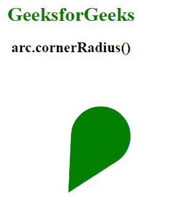
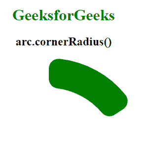

# D3.js 弧角半径()函数

> 原文:[https://www . geesforgeks . org/D3-js-arc-corner radius-function/](https://www.geeksforgeeks.org/d3-js-arc-cornerradius-function/)

**arc.cornerRadius()** 功能用于设置圆角的圆角半径。如果未指定半径，则返回当前拐角半径取值器，默认为:

```
function cornerRadius() {
    return 0;
}
```

**语法:**

```
arc.cornerRadius([radius]);

```

**参数:**该函数接受一个参数，如上所述，如下所述。

*   **半径:**该参数取一个决定拐角半径的数字。

**返回值:**此功能返回电弧发生器。

**例 1:**

## 超文本标记语言

```
<!DOCTYPE html> 
<html lang="en"> 

<head> 
    <meta charset="UTF-8" /> 
    <meta name="viewport"
          content="width=device-width, 
                  initial-scale=1.0"/> 

    <!--Fetching from CDN of D3.js -->
    <script src= 
        "https://d3js.org/d3.v6.min.js"> 
    </script>

</head>

<body> 
    <div style="width:300px; height:300px;">
        <center>

            <h1 style="color:green">
                GeeksforGeeks
            </h1> 

            <h2>
                arc.cornerRadius()
            </h2> 
        </center>

        <svg width="300" height="300">
        </svg>
    </div>

    <script> 
        var svg = d3.select("svg")
            .append("g")
            .attr("transform", "translate(150,200)");

        // An arc generator created
        var arc = d3.arc()
            .outerRadius(-5)
            .innerRadius(150)
            .startAngle(0)
            // Use of cornerRadius Function
            .cornerRadius(6666)
            .endAngle(1);

        svg.append("path")
            .attr("class", "arc")
            .attr("d", arc);

        let p = document.querySelector(".arc");
        p.style.fill="green";
    </script> 
</body>

</html>
```

**输出:**

[](https://media.geeksforgeeks.org/wp-content/uploads/20200824232208/01.PNG)

**例 2:**

## 超文本标记语言

```
<!DOCTYPE html> 
<html lang="en"> 

<head> 
    <meta charset="UTF-8" /> 
    <meta name="viewport"
          content="width=device-width, 
                  initial-scale=1.0"/> 

    <!--Fetching from CDN of D3.js -->
    <script src= 
        "https://d3js.org/d3.v6.min.js"> 
    </script>

</head>

<body> 
    <div style="width:300px; height:300px;">
        <center>
            <h1 style="color:green">
                GeeksforGeeks
            </h1> 

            <h2>
                arc.cornerRadius()
            </h2> 

        </center>

        <svg width="300" height="300">
        </svg>
    </div>

    <script> 
        var svg = d3.select("svg")
            .append("g")
            .attr("transform", "translate(120,200)");

        // An arc generated
        var arc = d3.arc()
            .outerRadius(140)
            .innerRadius(200)
            .startAngle(0)
            // Use of cornerRadius Function
            .cornerRadius(20)
            .endAngle(1);

        svg.append("path")
            .attr("class", "arc")
            .attr("d", arc);

        let p = document.querySelector(".arc");
        p.style.fill="green";
    </script> 
</body> 

</html>
```

**输出:**

[](https://media.geeksforgeeks.org/wp-content/uploads/20200824232420/01.PNG)