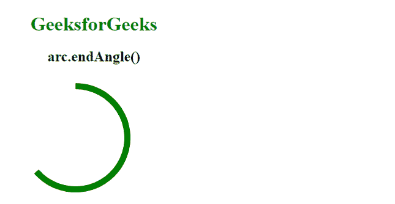
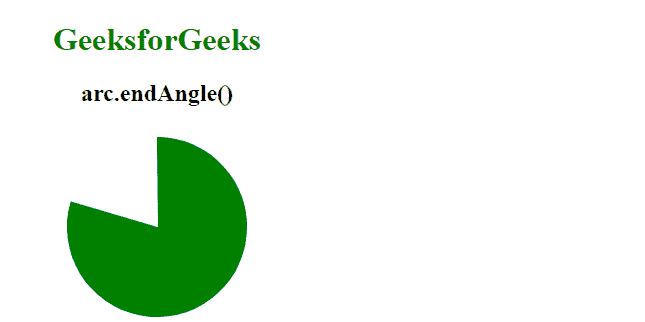

# D3.js arc.endAngle()功能

> 原文:[https://www.geeksforgeeks.org/d3-js-arc-endangle-function/](https://www.geeksforgeeks.org/d3-js-arc-endangle-function/)

**D3.js** 库的**弧线 endAngle()** 功能用于设置弧线的结束角度。此函数将结束角度设置为函数或整数。

**语法:**

```
arc.endAngle([angle]);

```

**参数:**该函数接受一个参数，如上所述，如下所述。

*   **角度:**这取一个对应于圆弧结束角度的数字。

**返回值:**这个函数不返回任何东西。

下面是上面给出的函数的几个例子。

**例 1:**

## 超文本标记语言

```
<!DOCTYPE html> 
<html lang="en"> 
    <head> 
        <meta charset="UTF-8" /> 
        <meta
            name="viewport"
            content="width=device-width, 
                    initial-scale=1.0"/>        
        <!--Fetching from CDN of D3.js -->
        <script src= 
        "https://d3js.org/d3.v6.min.js"> 
        </script>
    </head>
    <body> 
        <div style="width:300px; height:300px;">
            <center>
                <h1 style="color:green">
                    GeeksforGeeks
                </h1> 
                <h2>
                    arc.endAngle()
                </h2> 
            </center>
            <svg width="300" height="300">
            </svg>
        </div>
        <script> 
        var svg = d3.select("svg")
            .append("g")
            .attr("transform", "translate(120, 100)");

        // An arc will be produced
        var arc = d3.arc()
            .outerRadius(80)
            .innerRadius(90)
            .startAngle(0)
        // Use of arc.endAngle() Function    
            .endAngle(2*2);

        svg.append("path")
            .attr("class", "arc")
            .attr("d", arc);

        let p = document.querySelector(".arc");
        p.style.fill="green";
        </script> 
    </body> 
</html>
```

**输出:**



**例 2:**

## 超文本标记语言

```
<!DOCTYPE html> 
<html lang="en"> 
    <head> 
        <meta charset="UTF-8" /> 
        <meta
            name="viewport"
            content="width=device-width, 
                    initial-scale=1.0"/>         
        <!--Fetching from CDN of D3.js -->
        <script src= 
        "https://d3js.org/d3.v6.min.js"> 
        </script>
    </head>
    <body> 
        <div style="width:300px; height:300px;">
            <center>
                <h1 style="color:green">
                    GeeksforGeeks
                </h1> 
                <h2>
                    arc.endAngle()
                </h2> 
            </center>
            <svg width="300" height="300">
            </svg>
        </div>
        <script> 
        var svg = d3.select("svg")
            .append("g")
            .attr("transform", "translate(150, 100)");

        // An arc will be produced
        var arc = d3.arc()
            .outerRadius(-1)
            .innerRadius(90)
            .startAngle(0)
        // Use of arc.endAngle() Function    
            .endAngle(2*2.5);

        svg.append("path")
            .attr("class", "arc")
            .attr("d", arc);

        let p = document.querySelector(".arc");
        p.style.fill="green";
        </script> 
    </body> 
</html>
```

**输出:**

