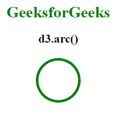
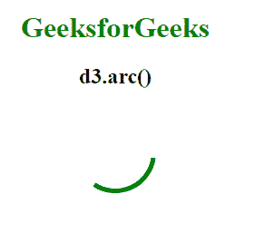
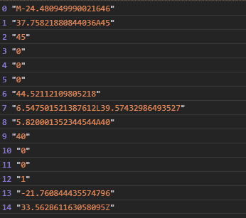

# D3.js arc()功能

> 原文:[https://www.geeksforgeeks.org/d3-js-arc-function/](https://www.geeksforgeeks.org/d3-js-arc-function/)

**d3.arc()** 功能用于生成一个产生圆形图表的电弧发生器。它基于起始角度和结束角度之间的差异。

**语法:**

```
d3.arc();
```

**参数:**此功能不接受任何参数。

**返回值:**该函数返回一个电弧发生器函数。

下面的例子说明了 D3.js 中的 d3.arc()函数:

**例 1:**

## 超文本标记语言

```
<!DOCTYPE html> 
<html lang="en"> 

<head> 
    <meta charset="UTF-8" /> 
    <meta name="viewport"
          content="width=device-width, 
                   initial-scale=1.0"/> 

    <!--Fetching from CDN of D3.js -->
    <script src= 
        "https://d3js.org/d3.v6.min.js"> 
    </script>
</head> 

<body> 
    <div style="width:300px; height:300px;">
        <center>
            <h1 style="color:green">
                GeeksforGeeks
            </h1> 

            <h2>
                d3.arc()
            </h2> 

        </center>

        <svg width="300" height="300">
        </svg>
    </div>

    <script> 
        var svg = d3.select("svg")
            .append("g")
            .attr("transform", "translate(150,50)");

        // Function is used
        var arc = d3.arc()
            .innerRadius(40)
            .outerRadius(45)
            .startAngle(100)
            .endAngle(2 * 180);

        svg.append("path")
            .attr("class", "arc")
            .attr("d", arc)
            .attr("fill","green");
    </script> 
</body> 

</html>
```

**输出:**

[](https://media.geeksforgeeks.org/wp-content/uploads/20200824205320/01.PNG)

**例 2:**

## 超文本标记语言

```
<!DOCTYPE html> 
<html lang="en">

<head> 
    <meta charset="UTF-8" /> 
    <meta name="viewport"
          content="width=device-width, 
                   initial-scale=1.0"/> 

    <!--Fetching from CDN of D3.js -->
    <script src= 
            "https://d3js.org/d3.v6.min.js"> 
    </script>
</head> 

<body> 
    <div style="width:300px; height:300px;">
        <center>

            <h1 style="color:green">
                GeeksforGeeks
            </h1> 

            <h2>d3.arc()</h2> 
        </center>

        <svg width="300" height="300">
        </svg>
    </div>

    <script> 
        var svg = d3.select("svg")
            .append("g")
            .attr("transform", "translate(150,50)");

        // An arc will be created
        var arc = d3.arc()
            .innerRadius(40)
            .outerRadius(45)
            .startAngle(10)
            .endAngle(8);

        svg.append("path")
            .attr("class", "arc")
            .attr("d", arc)
            .attr("fill","green");
    </script> 
</body> 

</html>
```

**输出:**

[](https://media.geeksforgeeks.org/wp-content/uploads/20200824205517/01.PNG)

**例 3:**

## 超文本标记语言

```
<!DOCTYPE html> 
<html lang="en"> 

<head> 
    <meta charset="UTF-8" /> 
    <meta name="viewport"
          content="width=device-width, 
                   initial-scale=1.0"/> 

    <!--Fetching from CDN of D3.js -->
    <script src= 
        "https://d3js.org/d3.v6.min.js"> 
    </script>

</head> 

<body> 
    <script> 
        var svg = d3.select("svg")
            .append("g")
            .attr("transform", "translate(150,50)");

        // An arc generator is produced
        var arc = d3.arc()
            .innerRadius(40)
            .outerRadius(45)
            .startAngle(10)
            .endAngle(8);

        let arr=arc().split(",");

        arr.forEach((e,i)=>{
            console.log(i,e);
        })
    </script> 
</body> 

</html>
```

**输出:**

[](https://media.geeksforgeeks.org/wp-content/uploads/20200824210522/01.PNG)