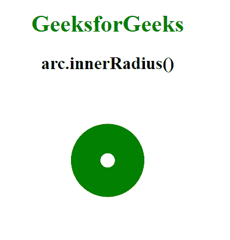

# D3.js 圆弧内半径()函数

> 原文:[https://www . geesforgeks . org/D3-js-arc-inner radius-function/](https://www.geeksforgeeks.org/d3-js-arc-innerradius-function/)

d3.js 中的**圆弧内半径**功能用于设置圆弧的内半径。它采用一个定义圆弧内半径的数字。

**语法:**

```
arc.innerRadius([radius]);
```

**参数:**该函数接受一个参数，如上所述，如下所述。

*   **半径:**定义圆弧内半径的大小。

**返回值:**这个函数不返回任何东西。

**例 1:**

## 超文本标记语言

```
<!DOCTYPE html>
<html lang="en">

<head>
    <meta charset="UTF-8" />
    <meta name="viewport"
          content="width=device-width,
                   initial-scale=1.0"/>

    <!--Fetching from CDN of D3.js -->
    <script src=
        "https://d3js.org/d3.v6.min.js">
    </script>

</head>

<body>
    <div style="width:300px; height:300px;">
        <center>
            <h1 style="color:green">
                GeeksforGeeks
            </h1>

            <h2>
                arc.innerRadius()
            </h2>
        </center>

        <svg width="300" height="300">
        </svg>
    </div>

    <script>
        var svg = d3.select("svg")
            .append("g")
            .attr("transform", "translate(150,100)");

        // Arc gernerator function
        var arc = d3.arc()
            .outerRadius(0)

            // Use of innerRadius Function
            .innerRadius(60)
            .startAngle(0)
            .endAngle(10);

        svg.append("path")
            .attr("class", "arc")
            .attr("d", arc);

        let p = document.querySelector(".arc");
        p.style.fill="green";
    </script>
</body>

</html>
```

**输出:**


**例 2:**

## 超文本标记语言

```
<!DOCTYPE html>
<html lang="en">

<head>
    <meta charset="UTF-8" />
    <meta name="viewport"
          content="width=device-width,
                   initial-scale=1.0"/>

    <!--Fetching from CDN of D3.js -->
    <script src=
        "https://d3js.org/d3.v6.min.js">
    </script>
</head>

<body>
    <div style="width:300px; height:300px;">
        <center>
            <h1 style="color:green">
                GeeksforGeeks
            </h1>

            <h2>
                arc.innerRadius()
            </h2>
        </center>

        <svg width="300" height="300">
        </svg>
    </div>

    <script>
        var svg = d3.select("svg")
            .append("g")
            .attr("transform", "translate(150,100)");

        // Arc generator function
        var arc = d3.arc()
            .outerRadius(10)

            // Use of innerRadius Function
            .innerRadius(50)
            .startAngle(0)
            .endAngle(10);

        svg.append("path")
            .attr("class", "arc")
            .attr("d", arc);

        let p = document.querySelector(".arc");
        p.style.fill="green";
    </script>
</body>

</html>
```

**输出:**

