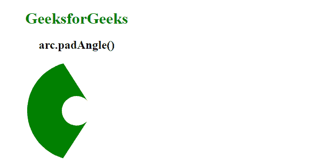

# D3.js arc.padAngle()功能

> 原文:[https://www.geeksforgeeks.org/d3-js-arc-padangle-function/](https://www.geeksforgeeks.org/d3-js-arc-padangle-function/)

**D3.js** 库中的**弧线. padAngle()** 功能用于将弧线的填充角度设置为指定的数值。该函数为某些填充弧设置相邻弧之间的角度。

**语法:**

```
 arc.padAngle([angle]);

```

**参数:**该函数接受一个参数，如上所述，如下所述。

*   **角度:**这取一个对应于弧线填充角度的数字。

**返回值:**这个函数不返回任何东西。

**例 1:**

## 超文本标记语言

```
<!DOCTYPE html>
<html lang="en">

<head>
    <meta charset="UTF-8" />
    <meta name="viewport" content=
        "width=device-width, 
        initial-scale=1.0" />

    <!--Fetching from CDN of D3.js -->
    <script src=
        "https://d3js.org/d3.v6.min.js">
    </script>
</head>

<body>
    <div style="width:300px; height:300px;">
        <center>
            <h1 style="color:green">
                GeeksforGeeks
            </h1>
            <h2>
                arc.padAngle()
            </h2>
        </center>
        <svg width="300" height="300">
        </svg>
    </div>

    <script>
        var svg = d3.select("svg")
            .append("g")
            .attr("transform", "translate(150, 100)");

        // An arc will be produced
        var arc = d3.arc()
            .outerRadius(20)
            .innerRadius(90)
            .startAngle(5)
            // Use of arc.padAngle() Function 
            .padAngle(.5)
            .endAngle(0.5);

        svg.append("path")
            .attr("class", "arc")
            .attr("d", arc);

        let p = document.querySelector(".arc");
        p.style.fill = "green";
    </script>
</body>

</html>
```

**输出:**


**例 2:**

## 超文本标记语言

```
<!DOCTYPE html>
<html lang="en">

<head>
    <meta charset="UTF-8" />
    <meta name="viewport" content=
        "width=device-width, 
        initial-scale=1.0" />

    <!--Fetching from CDN of D3.js -->
    <script src=
        "https://d3js.org/d3.v6.min.js">
    </script>
</head>

<body>
    <div style="width:300px; height:300px;">
        <center>
            <h1 style="color:green">
                GeeksforGeeks
            </h1>
            <h2>
                arc.padAngle()
            </h2>
        </center>
        <svg width="300" height="300">
        </svg>
    </div>

    <script>
        var svg = d3.select("svg")
            .append("g")
            .attr("transform", 
                "translate(150, 100)");

        // An arc will be produced
        var arc = d3.arc()
            .outerRadius(30)
            .innerRadius(100)
            .startAngle(10)
            // Use of arc.padAngle() Function 
            .padAngle(12)
            .endAngle(12);

        svg.append("path")
            .attr("class", "arc")
            .attr("d", arc);

        let p = document.querySelector(".arc");
        p.style.fill = "green";
    </script>
</body>

</html>
```

**输出:**

