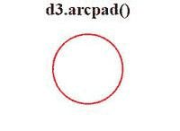
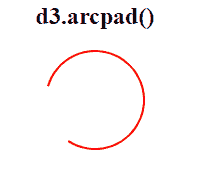

# D3.js arc.padRadius()函数

> 原文:[https://www.geeksforgeeks.org/d3-js-arc-padradius-function/](https://www.geeksforgeeks.org/d3-js-arc-padradius-function/)

d3.padRadius()函数用于设置圆弧中的焊盘半径。如果提供了焊盘半径，则它将焊盘半径设置为指定的函数或数字，并返回该电弧发生器。

如果未提供半径，则返回当前焊盘半径访问器，默认为空，表示焊盘半径自动计算为 sqrt(内半径*内半径+外半径*外半径)。焊盘半径计算相邻圆弧之间的固定直线距离，定义为焊盘半径*焊盘角度。

**语法:**

```
arc.padRadius([radius])
```

**参数:**该方法接受如上所述的单个参数，如下所述:

*   **半径**:焊盘半径的值。

**返回:**返回指定焊盘半径的圆弧。

**例 1:**

## 超文本标记语言

```
<!DOCTYPE html>
<html lang="en">

<head>
    <meta charset="UTF-8" />
    <meta name="viewport"
        content="width=device-width,
                initial-scale=1.0"/>

    <script src=
        "https://d3js.org/d3.v6.min.js">
    </script>
</head>

<body>
    <div style="width:300px; height:300px;">
        <center>

            <h2 style="color:black">
                d3.arcpad()
            </h2> 

        </center>

        <svg width="200" height="200">
        </svg>
    </div>

    <script>
        var svg = d3.select("svg")
            .append("g")
            .attr("transform", "translate(150,50)");

        // padding radius =10
        var arcpad = d3.arc()
            .innerRadius(48)
            .outerRadius(50)
            .padRadius(10)
            .startAngle(90)
            .endAngle(2 * 180);

        svg.append("path")
            .attr("class", "arc")
            .attr("d", arcpad)
            .attr("fill","red");
    </script>
</body>

</html>
```

**输出:**



**例 2:**

## 超文本标记语言

```
<!DOCTYPE html>
<html lang="en">

<head>
    <meta charset="UTF-8" />
    <meta name="viewport"
        content="width=device-width,
                initial-scale=1.0"/>

    <script src=
        "https://d3js.org/d3.v6.min.js">
    </script>
</head>

<body>
    <div style="width:300px; height:300px;">
        <center>

            <h2 style="color:black">
                d3.arcpad()
            </h2> 

        </center>

        <svg width="200" height="200">
        </svg>
    </div>

    <script>
        var svg = d3.select("svg")
            .append("g")
            .attr("transform", "translate(150,50)");

        // padding radius =5
        var arcpad = d3.arc()
            .innerRadius(48)
            .outerRadius(50)
            .padRadius(5)
            .startAngle(10)
            .endAngle(5);

        svg.append("path")
            .attr("class", "arc")
            .attr("d", arcpad)
            .attr("fill","red");
    </script>
</body>

</html>
```

**输出:**

