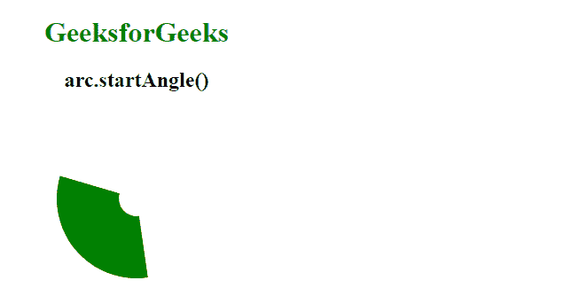
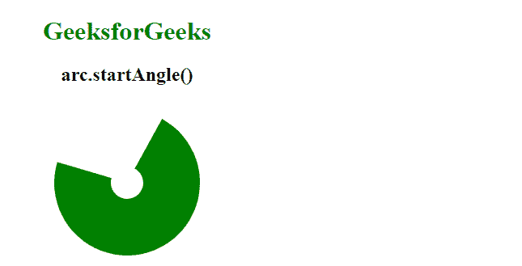

# D3.js arc.startAngle()函数

> 原文:[https://www . geesforgeks . org/D3-js-arc-startangle-function/](https://www.geeksforgeeks.org/d3-js-arc-startangle-function/)

**d3.js** 库中的**圆弧. endAngle()** 功能用于设置圆弧的起始角度。该函数将起始角度设置为函数或整数。

**语法:**

```
arc.startAngle([angle]);

```

**参数:**该函数接受一个参数，如上所述，如下所述。

*   **角度:**取一个对应于圆弧起始角度的数字。

**返回值:**这个函数不返回任何东西。

下面是上面给出的函数的几个例子。

**例 1:**

## 超文本标记语言

```
<!DOCTYPE html>
<html lang="en">

<head>
    <meta charset="UTF-8" />
    <meta name="viewport" content=
        "width=device-width, initial-scale=1.0" />

    <!--Fetching from CDN of D3.js -->
    <script src=
        "https://d3js.org/d3.v6.min.js">
    </script>
</head>

<body>
    <div style="width:300px; height:300px;">
        <center>
            <h1 style="color:green">
                GeeksforGeeks
            </h1>
            <h2>
                arc.startAngle()
            </h2>
        </center>
        <svg width="300" height="300">
        </svg>
    </div>

    <script>
        var svg = d3.select("svg")
            .append("g")
            .attr("transform", "translate(150, 100)");

        // An arc will be produced
        var arc = d3.arc()
            .outerRadius(20)
            .innerRadius(90)
            // Use of arc.startAngle() Function 
            .startAngle(3)
            .endAngle(2 * 2.5);

        svg.append("path")
            .attr("class", "arc")
            .attr("d", arc);

        let p = document.querySelector(".arc");
        p.style.fill = "green";
    </script>
</body>

</html>
```

**输出:**



**例 2:**

## 超文本标记语言

```
<!DOCTYPE html>
<html lang="en">

<head>
    <meta charset="UTF-8" />
    <meta name="viewport" content=
        "width=device-width, initial-scale=1.0" />

    <!--Fetching from CDN of D3.js -->
    <script src=
        "https://d3js.org/d3.v6.min.js">
    </script>
</head>

<body>
    <div style="width:300px; height:300px;">
        <center>
            <h1 style="color:green">
                GeeksforGeeks
            </h1>
            <h2>
                arc.startAngle()
            </h2>
        </center>
        <svg width="300" height="300">
        </svg>
    </div>

    <script>
        var svg = d3.select("svg")
            .append("g")
            .attr("transform", "translate(150, 100)");

        // An arc will be produced
        var arc = d3.arc()
            .outerRadius(20)
            .innerRadius(90)
            // Use of arc.startAngle() Function 
            .startAngle(5)
            .endAngle(0.5);

        svg.append("path")
            .attr("class", "arc")
            .attr("d", arc);

        let p = document.querySelector(".arc");
        p.style.fill = "green";
    </script>
</body>

</html>
```

**输出:**

