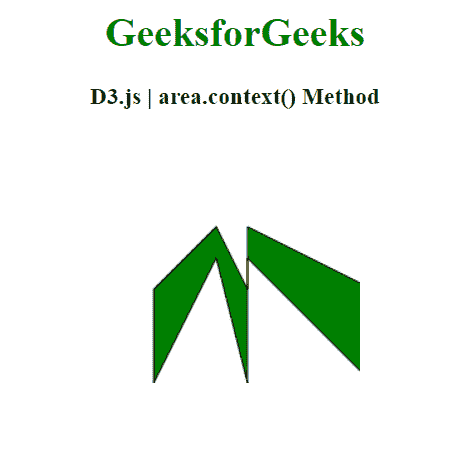
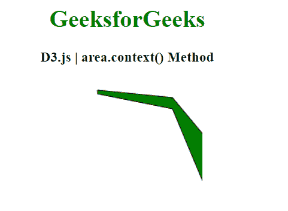

# D3.js area.context()方法

> 原文:[https://www.geeksforgeeks.org/d3-js-area-context-method/](https://www.geeksforgeeks.org/d3-js-area-context-method/)

**d3.area.context()方法**允许您在画布元素的上下文中渲染区域。调用生成器时，该区域将在当前上下文中呈现。我们可以使用这种方法自行设置线条的上下文，如颜色、笔画、填充等。默认值为空。

**语法:**

```
d3.area.context(_context);

```

**参数:**

*   **_ 上下文:**用户设置的上下文。

**返回值:**该方法返回当前上下文。

**例 1:**

## 超文本标记语言

```
<!DOCTYPE html>
<html>
<head>
    <meta charset="utf-8">

    <script src=
        "https://d3js.org/d3.v5.min.js">
    </script>
</head>

<body>
    <h1 style="text-align: center; color: green;">
        GeeksforGeeks
    </h1>

    <h3 style="text-align: center;">
        D3.js | area.context() Method
    </h3>

    <center>
        <canvas id="gfg" width="200" height="200">
        </canvas>
    </center>

    <script>
        var data = [
          {xpoint: 25,  ypoint: 150},
          {xpoint: 75,  ypoint: 50},
          {xpoint: 100, ypoint: 150},
          {xpoint: 100, ypoint: 50},
          {xpoint: 200, ypoint: 150}];

        var context = d3.select("#gfg")
               .node().getContext("2d");

        var Gen = d3.area()
              .x((p) => p.xpoint)
              .y0((p) => p.ypoint/2)
              .y1((p) => p.ypoint)
              .context(context);

        context.translate(10,50);              
        Gen(data);
        context.strokeStyle = "black";
        context.fillStyle = "green";
        context.fill();
        context.stroke();
    </script>
</body>

</html>
```

**输出:**



**例 2:**

## 超文本标记语言

```
<!DOCTYPE html>
<html>
<head>
    <meta charset="utf-8">

    <script src=
        "https://d3js.org/d3.v5.min.js">
    </script>
</head>

<body>
    <h1 style="text-align: center; color: green;">
        GeeksforGeeks
    </h1>

    <h3 style="text-align: center;">
        D3.js | area.context() Method
    </h3>

    <center>
        <canvas id="gfg" width="200" height="200">
        </canvas>
    </center>

    <script>
        var points = [
          {x: 50, y: 10},
          {x: 150, y: 30},
          {x: 200, y: 150},
          {x: 250, y: 10},
          {x: 300, y: 150},
          {x: 350, y: 50},
          {x: 400, y: 190}];

        var context = d3.select("#gfg")
               .node().getContext("2d");

        var Gen = d3.area()
              .x((p) => p.x)
              .y0((p) => p.y/2)
              .y1((p) => p.y)
              .context(context);

        context.translate(10,10);              
        Gen(points);
        context.strokeStyle = "black";
        context.fillStyle = "green";
        context.fill();
        context.stroke();

    </script>
</body>

</html>
```

**输出:**

