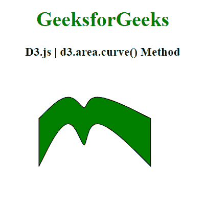
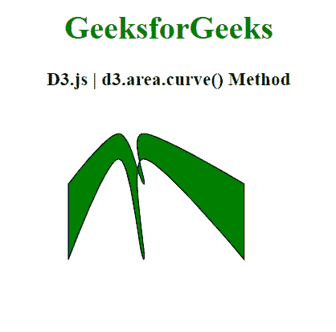

# D3.js 面积.曲线()方法

> 原文:[https://www.geeksforgeeks.org/d3-js-area-curve-method/](https://www.geeksforgeeks.org/d3-js-area-curve-method/)

使用 **d3.area.curve()方法** 给区域一条曲线。D3.js 提供了几个曲线工厂，可以用来给出不同的曲线。

**语法:**

```
d3.area.curve(curve_factory)

```

**参数:** 该函数接受单个参数，如上所述，如下所述。

*   **曲线 _ 工厂:**该参数是要给区域的曲线的类型。

**返回值:**这个方法没有返回值。

**例 1:**

## 超文本标记语言

```
<!DOCTYPE html>
<html>
<head>
    <meta charset="utf-8">

    <script src=
"https://cdnjs.cloudflare.com/ajax/libs/d3/4.2.2/d3.min.js">
    </script>
</head>
<body>
    <h1 style="text-align: center; color: green;">
        GeeksforGeeks
    </h1>

    <h3 style="text-align: center;">
        D3.js | d3.area.curve() Method
    </h3>

    <center>
        <svg id="gfg" width="250" height="200"></svg>
    </center>

    <script>
        var points = [
          {xpoint: 25,  ypoint: 150},
          {xpoint: 75,  ypoint: 50},
          {xpoint: 100, ypoint: 150},
          {xpoint: 100, ypoint: 50},
          {xpoint: 200, ypoint: 150}];

        var Gen = d3.area()
          .x((p) => p.xpoint)
          .y0((p) => p.ypoint/2)
          .y1((p) => p.ypoint)

          // Using curveBasis
          .curve(d3.curveBasis);

        d3.select("#gfg")
          .append("path")
          .attr("d", Gen(points))
          .attr("fill", "green")
          .attr("stroke", "black");

    </script>
</body>

</html>
```

**输出:**



**例 2:**

## 超文本标记语言

```
<!DOCTYPE html>
<html>
<head>
    <meta charset="utf-8">

    <script src=
"https://cdnjs.cloudflare.com/ajax/libs/d3/4.2.2/d3.min.js">
    </script>
</head>
<body>
    <h1 style="text-align: center; color: green;">
        GeeksforGeeks
    </h1>

    <h3 style="text-align: center;">
        D3.js | d3.area.curve() Method
    </h3>

    <center>
        <svg id="gfg" width="250" height="200"></svg>
    </center>

    <script>
        var points = [
          {xpoint: 25,  ypoint: 150},
          {xpoint: 75,  ypoint: 50},
          {xpoint: 100, ypoint: 150},
          {xpoint: 100, ypoint: 50},
          {xpoint: 200, ypoint: 150}];

        var Gen = d3.area()
          .x((p) => p.xpoint)
          .y0((p) => p.ypoint/2)
          .y1((p) => p.ypoint)

          // Using curveCardinal
          .curve(d3.curveCardinal);

        d3.select("#gfg")
          .append("path")
          .attr("d", Gen(points))
          .attr("fill", "green")
          .attr("stroke", "black");

    </script>
</body>

</html>
```

**输出:**

