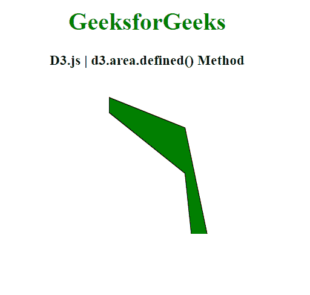
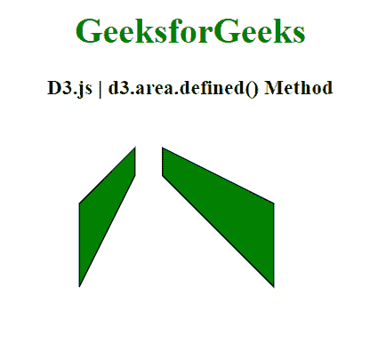

# D3.js 面积定义()方法

> 原文:[https://www.geeksforgeeks.org/d3-js-area-defined-method/](https://www.geeksforgeeks.org/d3-js-area-defined-method/)

通过 **d3.area.defined()方法** 可以指定是否为给定的数据点定义了数据。如果此方法返回 false，这意味着数据点存在，否则返回 true。

**语法:**

```
d3.area.defined(data_point)

```

**参数:** 该函数接受单个参数，如上所述，如下所述。

*   **数据点:**此参数为待查的数据点。

**返回值:** 这个方法返回一个布尔值。

**例 1:**

## 超文本标记语言

```
<!DOCTYPE html>
<html>
<head>
    <meta charset="utf-8">

    <script src=
"https://cdnjs.cloudflare.com/ajax/libs/d3/4.2.2/d3.min.js">
    </script>
</head>

<body>
    <h1 style="text-align: center; color: green;">
        GeeksforGeeks
    </h1>

    <h3 style="text-align: center;">
        D3.js | d3.area.defined() Method
    </h3>

    <center>
        <svg id="gfg" width="200" height="200">
        </svg>
    </center>

    <script>
        var data = [
          {x: 50, y: 10},
          {x: 150, y: 30},
          {x: 200, y: 150},
          {x: 250, y: 10},
          {x: 300, y: 150},
          {x: 350, y: 50},
          {x: 400, y: 190}];

        var xScale = d3.scaleLinear()
            .domain([0, 8]).range([25, 200]);
        var yScale = d3.scaleLinear()
            .domain([0,20]).range([200, 25]);

        var Gen = d3.area()
          .x((p) => p.x)
          .y0((p) => p.y*2)
          .y1((p) => p.y*4)

          // Excluding 3rd index
          .defined((d,i) => (i != 3));

        d3.select("#gfg")
          .append("path")
          .attr("d", Gen(data))
          .attr("fill", "green")
          .attr("stroke", "black");
    </script>
</body>

</html>
```

**输出:**



**例 2:**

## 超文本标记语言

```
<!DOCTYPE html>
<html>
<head>
    <meta charset="utf-8">

    <script src=
"https://cdnjs.cloudflare.com/ajax/libs/d3/4.2.2/d3.min.js">
    </script>
</head>

<body>
    <h1 style="text-align: center; color: green;">
        GeeksforGeeks
    </h1>

    <h3 style="text-align: center;">
        D3.js | d3.area.defined() Method
    </h3>

    <center>
        <svg id="gfg" width="250" height="200"></svg>
    </center>

    <script>
        var points = [
          {xpoint: 25,  ypoint: 150},
          {xpoint: 75,  ypoint: 50},
          {xpoint: 100, ypoint: 150},
          {xpoint: 100, ypoint: 50},
          {xpoint: 200, ypoint: 150}];

        var Gen = d3.area()
          .x((p) => p.xpoint)
          .y0((p) => p.ypoint/2)
          .y1((p) => p.ypoint)

          // Excluding 2nd index
          .defined((d,i) => (i != 2));

        d3.select("#gfg")
          .append("path")
          .attr("d", Gen(points))
          .attr("fill", "green")
          .attr("stroke", "black");

    </script>
</body>

</html>
```

**输出:**

