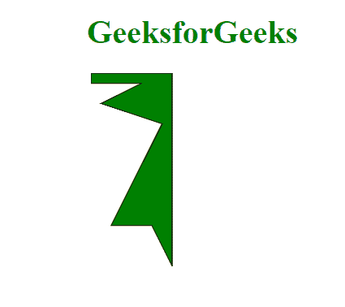
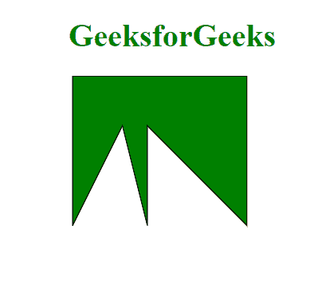

# D3.js 面积()方法

> 原文:[https://www.geeksforgeeks.org/d3-js-area-method/](https://www.geeksforgeeks.org/d3-js-area-method/)

**D3 . js**中的 **d3.area()** 方法用于返回带有默认设置的区域生成器，该生成器可进一步用于创建区域。

**语法:**

```
d3.area()
```

**参数:**此方法不接受参数。

**返回值:**此方法不返回值。

以下示例说明了 D3.js 中的 **d3.area()** 方法:

**例 1:**

## 超文本标记语言

```
<!DOCTYPE html>
<html>

<head>
    <script src="https://d3js.org/d3.v4.min.js">
    </script>
</head>

<body>
    <h1 style="text-align: center;
             color: green;">
        GeeksforGeeks
    </h1>

    <center>
        <svg id="gfg" width="200" height="200">
        </svg>
    </center>

    <script>
        var data = [
            { x: 0, y: 10 },
            { x: 10, y: 30 },
            { x: 20, y: 150 },
            { x: 50, y: 10 },
            { x: 60, y: 150 },
            { x: 70, y: 50 },
            { x: 80, y: 190 }];

        data.sort((a, b) => a.y - b.y);

        var xScale = d3.scaleLinear()
            .domain([0, 8])
            .range([25, 200]);
        var yScale = d3.scaleLinear()
            .domain([0, 20])
            .range([200, 25]);

        // Using area() function to
        // generate area
        var Gen = d3.area()
            .x((p) => p.x)
            .y0((p) => 0)
            .y1((p) => p.y);

        d3.select("#gfg")
            .append("path")
            .attr("d", Gen(data))
            .attr("fill", "green")
            .attr("stroke", "black");
    </script>
</body>

</html>
```

**输出:**



**例 2:**

## 超文本标记语言

```
<!DOCTYPE html>
<html>

<head>
    <script src="https://d3js.org/d3.v4.min.js">
    </script>
</head>

<body>
    <h1 style="text-align: center; 
             color: green;">
        GeeksforGeeks
    </h1>

    <center>
        <svg id="gfg" width="250" height="200">
        </svg>
    </center>

    <script>
        var points = [
            { xpoint: 25, ypoint: 150 },
            { xpoint: 75, ypoint: 50 },
            { xpoint: 100, ypoint: 150 },
            { xpoint: 100, ypoint: 50 },
            { xpoint: 200, ypoint: 150 }];

        // Using area() function to generate area
        var Gen = d3.area()
            .x((p) => p.xpoint)
            .y0((p) => 0)
            .y1((p) => p.ypoint);

        d3.select("#gfg")
            .append("path")
            .attr("d", Gen(points))
            .attr("fill", "green")
            .attr("stroke", "black");

    </script>
</body>

</html>
```

**输出:**

