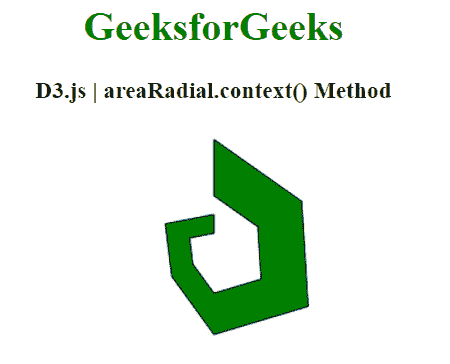
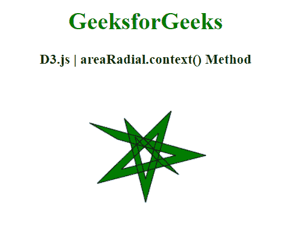

# D3.js areaRadial.context()方法

> 原文:[https://www . geesforgeks . org/D3-js-area radial-context-method/](https://www.geeksforgeeks.org/d3-js-arearadial-context-method/)

**D3.js** 中的 **areaRadial.context()** 方法允许您指定画布元素的上下文，区域 Radial 将在该上下文中渲染。调用生成器时，将在当前上下文中呈现径向区域。我们可以使用这种方法自行设置区域的上下文，如颜色、描边、填充等。默认值为空。

**语法:**

```
d3.areaRadial.context( _context )

```

**参数:** 该方法接受如上所述的单个参数，描述如下:

*   **_ 上下文:**是用户设置的上下文。

**返回值:**该方法返回当前上下文。

下面给出了 D3.js 中**Arerarchy . context()**方法的几个例子:

**例 1:**

## 超文本标记语言

```
<!DOCTYPE html>
<html>
<head>
  <script src=
"https://d3js.org/d3.v5.min.js">
  </script>
</head>
<body>
  <h1 style="text-align: center;
             color: green;">
    GeeksforGeeks
  </h1>
  <h3 style="text-align: center;">
    D3.js | areaRadial.context() Method
  </h3>
  <center>
    <canvas id="gfg" width="200" height="200">
    </canvas>
  </center>
  <script>
    var points = [
      { x: 0, y: 0 },
      { x: 2, y: 3 },
      { x: 4, y: 1 },
      { x: 6, y: 8 },
      { x: 8, y: 17 },
      { x: 10, y: 15 },
      { x: 12, y: 20 }];

    // Get the context
    var context = d3.select("#gfg")
        .node()
        .getContext("2d");

    var xScale = d3.scaleLinear()
        .domain([0, 6])
        .range([0, 2 * Math.PI]);
    var yScale = d3.scaleLinear()
        .domain([0, 20])
        .range([90, 30]);

    var Gen = d3.areaRadial()
      .angle(d => xScale(d.x / 2))
      .innerRadius(d => yScale(d.y) / 2)
      .outerRadius(d => yScale(d.y))

      // Specify the context
      // to be used
      .context(context);

    context.translate(100, 100);
    Gen(points);
    context.strokeStyle = "black";
    context.fillStyle = "green";
    context.fill();
    context.stroke();
  </script>
</body>
</html>
```

**输出:**



**例 2:**

## 超文本标记语言

```
<!DOCTYPE html>
<html>
<head>
  <script src=
"https://d3js.org/d3.v5.min.js">
  </script>
</head>
<body>
  <h1 style="text-align: center;
             color: green;">
    GeeksforGeeks
  </h1>
  <h3 style="text-align: center;">
    D3.js | areaRadial.context() Method
  </h3>
  <center>
    <canvas id="gfg" width="200" height="200">
    </canvas>
  </center>
  <script>
    var data = [
      { x: 10, y: 1 },
      { x: 15, y: 3 },
      { x: 20, y: 5 },
      { x: 25, y: 7 },
      { x: 30, y: 9 },
      { x: 35, y: 11 },
      { x: 40, y: 13 }];

    // Get the context
    var context = d3.select("#gfg")
        .node()
        .getContext("2d");

    var xScale = d3.scaleLinear()
        .domain([0, 6])
        .range([0, 2 * Math.PI]);
    var yScale = d3.scaleLinear()
        .domain([0, 20])
        .range([90, 30]);

    var Gen = d3.areaRadial()
      .angle(d => xScale(d.x / 2))
      .innerRadius(d => yScale(d.y) / 2)
      .outerRadius(d => yScale(d.y))

      // Specify the context
      // to be used
      .context(context);

    context.translate(100, 100);
    Gen(data);
    context.strokeStyle = "black";
    context.fillStyle = "green";
    context.fill();
    context.stroke();
  </script>
</body>
</html>
```

**输出:**

