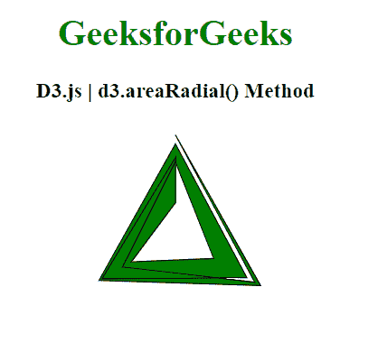
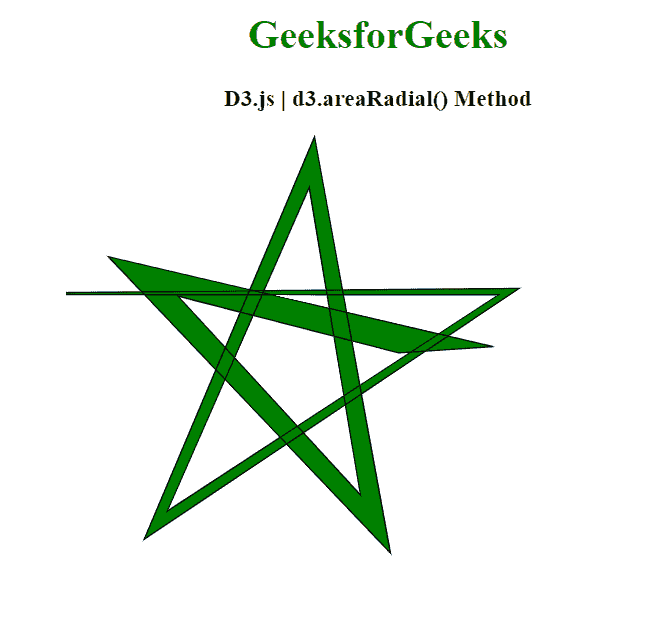

# D3.js areaRadial()方法

> 原文:[https://www.geeksforgeeks.org/d3-js-arearadial-method/](https://www.geeksforgeeks.org/d3-js-arearadial-method/)

**D3 . js**中的 **d3.areaRadial()方法**返回一个带有创建径向区域默认设置的区域径向生成器。径向区域生成器使用角度和半径访问器来创建区域。径向区域始终相对于原点定位。

**语法:**

```
d3.areaRadial()
```

**参数:**此方法不接受任何参数。

**返回值:**此方法不返回值。

下面举几个 D3.js 中**D3 . areradial()**方法的例子；

**例 1:**

## 超文本标记语言

```
<!DOCTYPE html>
<html>

<head>
    <script src="https://d3js.org/d3.v5.min.js">
    </script>
</head>

<body>
    <h1 style="text-align: center; 
             color: green;">
        GeeksforGeeks
    </h1>
    <h3 style="text-align: center;">
        D3.js | d3.areaRadial() Method
    </h3>
    <center>
        <svg id="gfg" width="200" height="200">
            <g transform="translate(100,100)"></g>
        </svg>
    </center>
    <script>
        var points = [
            { x: 0, y: 0 },
            { x: 2, y: 3 },
            { x: 4, y: 12 },
            { x: 6, y: 8 },
            { x: 8, y: 17 },
            { x: 10, y: 15 },
            { x: 12, y: 20 }];

        var xScale = d3.scaleLinear()
            .domain([0, 6])
            .range([0, 2 * Math.PI]);
        var yScale = d3.scaleLinear()
            .domain([0, 20])
            .range([90, 30]);

        // Use the areaRadial() method
        // to get an area generator 
        var Gen = d3.areaRadial()
            .angle(d => xScale(d.x))
            .innerRadius(d => yScale(d.y / 3))
            .outerRadius(d => yScale(d.y));

        d3.select("#gfg")
            .select("g")
            .append("path")
            .attr("d", Gen(points))
            .attr("fill", "green")
            .attr("stroke", "black");
    </script>
</body>

</html>
```

**输出:**



**例 2:**

## 超文本标记语言

```
<!DOCTYPE html>
<html>

<head>
    <script src="https://d3js.org/d3.v5.min.js">
    </script>
</head>

<body>
    <h1 style="text-align: center;
             color: green;">
        GeeksforGeeks
    </h1>
    <h3 style="text-align: center;">
        D3.js | d3.areaRadial() Method
    </h3>
    <center>
        <svg id="gfg" width="500" height="500">
            <g transform="translate(180,180)"></g>
        </svg>
    </center>
    <script>
        var data = [
            { x: 10, y: 1 },
            { x: 15, y: 3 },
            { x: 20, y: 5 },
            { x: 25, y: 7 },
            { x: 30, y: 9 },
            { x: 35, y: 11 },
            { x: 40, y: 13 }];

        var xScale = d3.scaleLinear()
            .domain([0, 8])
            .range([25, 200]);
        var yScale = d3.scaleLinear()
            .domain([0, 20])
            .range([200, 25]);

        // Use the areaRadial() method
        // to get an area generator 
        var Gen = d3.areaRadial()
            .angle(d => xScale(d.x))
            .innerRadius(d => yScale(d.y / 3))
            .outerRadius(d => yScale(d.y));

        d3.select("#gfg")
            .select("g")
            .append("path")
            .attr("d", Gen(data))
            .attr("fill", "green")
            .attr("stroke", "black");
    </script>
</body>

</html>
```

**输出:**

