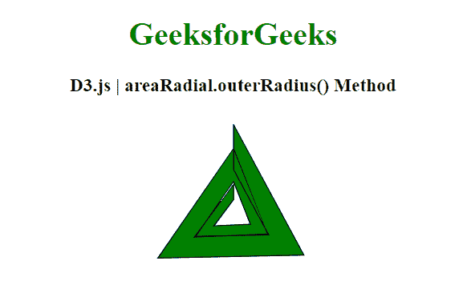
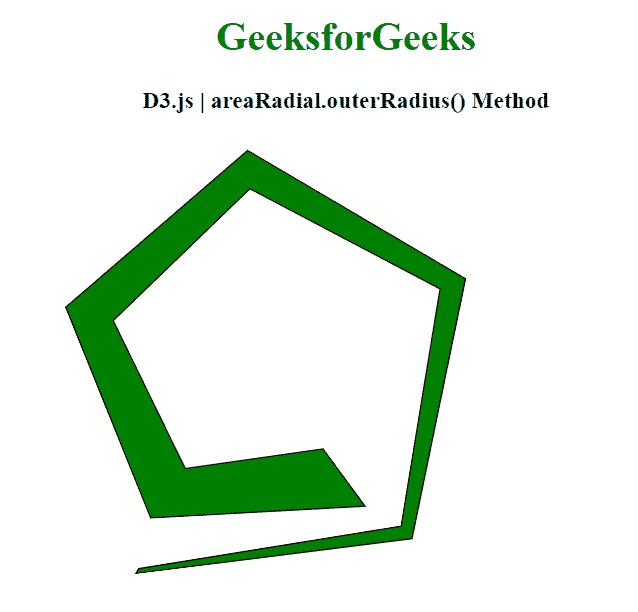

# D3.js 面积径向外径()方法

> 原文:[https://www . geesforgeks . org/D3-js-area radial-outer radius-method/](https://www.geeksforgeeks.org/d3-js-arearadial-outerradius-method/)

**区域径向外半径()**方法用于设置或返回区域径向的*外半径*取值器。它可以是一个数字，也可以是一个函数，返回一个代表我们区域外半径的数字。

**语法:**

```
 areaRadial.outerRadius(outer_Rad);

```

**参数:**该方法接受如上所述的单个参数，描述如下:

*   **outer_Rad:** 此参数保存外半径，可以是一个数字或返回外半径的函数。

**返回值:**该方法返回区域半径的外半径取值函数。

**例 1:**

## 超文本标记语言

```
<!DOCTYPE html>
<html>
<head>
    <meta charset="utf-8">

    <script src=
        "https://d3js.org/d3.v5.min.js">
    </script>
</head>

<body>
    <h1 style="text-align: center; color: green;">
        GeeksforGeeks
    </h1>

    <h3 style="text-align: center;">
        D3.js | areaRadial.outerRadius() Method
    </h3>

    <center>
        <svg id="gfg" width="200" height="200">
            <g transform="translate(100, 100)"></g>
        </svg>
    </center>

    <script>
        var points = [
                {x: 0, y: 0},
                {x: 2, y: 3},
                {x: 4, y: 1},
                {x: 6, y: 8},
                {x: 8, y: 17},
                {x: 10, y: 15},
                {x: 12, y: 20}];

        var xScale = 
        d3.scaleLinear().domain([0, 6]).range([0, 2 * Math.PI]);
        var yScale = 
        d3.scaleLinear().domain([0, 20]).range([90, 30]);

        var Gen = d3.areaRadial()
             .angle(d => xScale(d.x))
             .innerRadius(d => yScale(d.y)/2)
             // Setting outerRadius
             .outerRadius(d => yScale(d.y));

        d3.select("#gfg")
          .select("g")
          .append("path")
          .attr("d", Gen(points))
          .attr("fill", "green")
          .attr("stroke", "black");

    </script>
</body>

</html>
```

**输出:**



**例 2:**

## 超文本标记语言

```
<!DOCTYPE html>
<html>
<head>
    <meta charset="utf-8">
    <script src=
        "https://d3js.org/d3.v5.min.js">
    </script>
</head>

<body>
    <h1 style="text-align: center; color: green;">
        GeeksforGeeks
    </h1>

    <h3 style="text-align: center;">
        D3.js | areaRadial.outerRadius() Method
    </h3>

    <center>
        <svg id="gfg" width="500" height="500">
            <g transform="translate(180, 180)"></g>
        </svg>
    </center>

    <script>
        var data = [
          {x: 10, y: 1},
          {x: 15, y: 3},
          {x: 20, y: 5},
          {x: 25, y: 7},
          {x: 30, y: 9},
          {x: 35, y: 11},
          {x: 40, y: 13}];

        var xScale = d3.scaleLinear()
            .domain([0, 8]).range([25, 200]);
        var yScale = d3.scaleLinear()
            .domain([0, 20]).range([200, 25]);

        var Gen = d3.areaRadial()
             .angle(d => xScale(d.x/3))
             .innerRadius(d => yScale(d.y/2))

             // Setting outerRadius
             .outerRadius(d => yScale(d.y));

        d3.select("#gfg")
          .select("g")
          .append("path")
          .attr("d", Gen(data))
          .attr("fill", "green")
          .attr("stroke", "black");
    </script>
</body>

</html>
```

**输出:**

