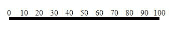
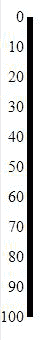
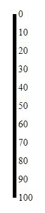

# D3.js 轴. orient()功能

> 原文:[https://www.geeksforgeeks.org/d3-js-axis-orient-function/](https://www.geeksforgeeks.org/d3-js-axis-orient-function/)

D3.js 中的 **d3.axis.orient()函数**用于设置方向并返回轴。如果未指定方向，则返回默认为“底部”的当前方向。

**语法:**

```
axis.orient([orientation])

```

**参数:**该函数接受如上所述的单个参数，如下所述:

*   **方向:**该参数是设置轴方向的尺寸。支持的四个方向是:“顶部”、“底部”。“左”和“右”。

**返回值:**该函数返回坐标轴。

以下程序说明了 D3.js 中的 **d3.axis.orient()** 功能:

**例 1:**

## 超文本标记语言

```
<html>
   <head>
       <title> 
        D3.js | d3.axis.orient() Function
        </title> 
        <script src = "//d3js.org/d3.v3.min.js"></script>
   </head>

   <body>
      <script>
      var svg = d3.select("body").append("svg")
                  .attr("width", 400)
                  .attr("height", 400);

      // Create the Scale we will use for the Axis
      var axisScale = d3.scale.linear()
                        .domain([0, 100])
                        .range([0, 300]);

      // Create the Axis
      var xAxis = d3.svg.axis()
                    .scale(axisScale)
                    .orient("top");

      // Create an SVG group Element for the Axis 
      // elements and call the xAxis function
      svg.append("g")
         .attr("transform", "translate(50,50)")
         .call(xAxis);
      </script>
   </body>
</html>
```

**输出:**



**例 2:**

## 超文本标记语言

```
<html>
   <head>
       <title> 
        D3.js | d3.axis.orient() Function
        </title> 
        <script src = "//d3js.org/d3.v3.min.js"></script>
   </head>

   <body>
      <script>
      var svg = d3.select("body").append("svg")
                  .attr("width", 400)
                  .attr("height", 400);

      // Create the Scale we will use for the Axis
      var axisScale = d3.scale.linear()
                        .domain([0, 100])
                        .range([0, 300]);

      // Create the Axis
      var xAxis = d3.svg.axis()
                    .scale(axisScale)
                    .orient("left");

      // Create an SVG group Element for the Axis 
      // elements and call the xAxis function
      svg.append("g")
         .attr("transform", "translate(50,50)")
         .call(xAxis);
      </script>
   </body>
</html>
```

**输出:**



**例 3:**

## 超文本标记语言

```
<html>
   <head>
       <title> 
        D3.js | d3.axis.orient() Function
        </title> 
        <script src = "//d3js.org/d3.v3.min.js"></script>
   </head>

   <body>
      <script>
      var svg = d3.select("body").append("svg")
                  .attr("width", 400)
                  .attr("height", 400);

      // Create the Scale we will use for the Axis
      var axisScale = d3.scale.linear()
                        .domain([0, 100])
                        .range([0, 300]);

      // Create the Axis
      var xAxis = d3.svg.axis()
                    .scale(axisScale)
                    .orient("right");

      // Create an SVG group Element for the Axis 
      // elements and call the xAxis function
      svg.append("g")
         .attr("transform", "translate(50,50)")
         .call(xAxis);
      </script>
   </body>
</html>
```

**输出:**

