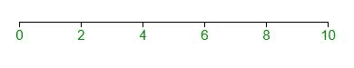
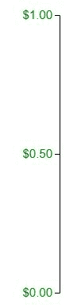

# D3.js axis.tickArguments()函数

> 原文:[https://www . geesforgeks . org/D3-js-axis-tick arguments-function/](https://www.geeksforgeeks.org/d3-js-axis-tickarguments-function/)

D3.js 中的 **d3.axis.tickArguments()函数**用于控制轴显示哪些刻度。该函数返回轴生成器

**语法:**

```
axis.tickArguments([arguments])

```

**参数:**该功能接受如上所述的单个参数，描述如下:

*   **参数:**这些参数用于显示刻度数和自定义刻度值的格式。

**返回值:**该函数返回轴生成器。

**注意:**这类似于 d3.axis.tick()函数，但在该函数中，所有参数都可以是可选的。

下面的程序说明了 D3.js 中的 **d3.axis.tickArguments()** 函数:

**例 1:**

## 超文本标记语言

```
<!DOCTYPE html>
<html>

<head>
    <title>
        D3.js | D3.axis.tickArguments() Function
    </title>

    <script type="text/javascript" 
        src="https://d3js.org/d3.v4.min.js">
    </script>

    <style>
        svg text {
            fill: green;
            font: 15px sans-serif;
            text-anchor: center;
        }
    </style>
</head>

<body>
    <script>
        var width = 400, height = 400;
        var svg = d3.select("body")
            .append("svg")
            .attr("width", width)
            .attr("height", height);

        var xscale = d3.scaleLinear()
            .domain([0, 10])
            .range([0, width - 60]);

        var x_axis = d3.axisBottom()
            .scale(xscale).tickArguments([5]);

        var xAxisTranslate = height / 2;

        svg.append("g")
            .attr("transform", "translate(50, "
                + xAxisTranslate + ")")
            .call(x_axis) 
    </script>
</body>

</html>
```

**输出:**



**例 2:**

## 超文本标记语言

```
<!DOCTYPE html>
<html>

<head>
    <title>
        D3.js | d3.axis.tickArguments() Function
    </title>

    <script type="text/javascript" 
        src="https://d3js.org/d3.v4.min.js">
    </script>

    <style>
        svg text {
            fill: green;
            font: 15px sans-serif;
            text-anchor: end;
        }
    </style>
</head>

<body>
    <script>
        var width = 400, height = 400;
        var svg = d3.select("body")
            .append("svg")
            .attr("width", width)
            .attr("height", height);

        var yscale = d3.scaleLinear()
            .domain([0, 1])
            .range([height - 50, 0]);

        var y_axis = d3.axisLeft()
            .scale(yscale).tickArguments([3, "$.2f"]);

        svg.append("g")
            .attr("transform", "translate(100,20)")
            .call(y_axis) 
    </script>
</body>

</html>
```

**输出:**

