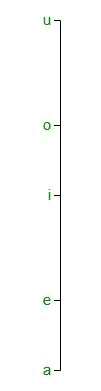
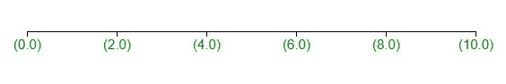

# D3.js axis.tickFormat()函数

> 原文:[https://www . geesforgeks . org/D3-js-axis-tick format-function/](https://www.geeksforgeeks.org/d3-js-axis-tickformat-function/)

D3.js 中的 **d3.axis.tickFormat()函数**用于控制标记哪些刻度。这个函数用来实现你自己的刻度格式函数。

**语法:**

```
axis.tickFormat([format])
```

**参数:**该函数接受以下参数。

*   **格式:**这些参数是设置刻度格式功能的格式。

**返回值:**该函数返回当前设置的勾号格式函数，默认为空。

以下程序说明了 D3.js 中的 **d3.axis.tickFormat()** 功能:

**例 1:**

```
<!DOCTYPE html> 
<html> 

<head> 
    <title> 
        D3.js | D3.axis.tickFormat() Function 
    </title> 
    <script type="text/javascript"
        src="https://d3js.org/d3.v4.min.js"> 
    </script> 

    <style> 
        svg text { 
            fill: green; 
            font: 15px sans-serif; 
            text-anchor: center; 
        } 
    </style> 
</head> 

<body> 
    <script> 
        var width = 400, height = 400; 
        var svg = d3.select("body") 
            .append("svg") 
            .attr("width", width) 
            .attr("height", height); 

        var yscale = d3.scaleLinear() 
            .domain([0, 1]) 
            .range([height - 50, 0]); 

        var y_axis = d3.axisLeft().scale(yscale)
        .tickValues([0, .2, .5, .70, 1])
        .tickFormat((d, i) => ['a', 'e', 'i', 'o', 'u'][i]); 

        svg.append("g") 
            .attr("transform", "translate(100, 20)") 
            .call(y_axis) 
    </script>
</body> 
</html>
```

**输出:**



**例 2:**

```
<!DOCTYPE html> 
<html> 

<head> 
    <title> 
        D3.js | D3.axis.tickFormat() Function 
    </title> 
    <script type="text/javascript"
        src="https://d3js.org/d3.v4.min.js"> 
    </script> 

    <style> 
        svg text { 
            fill: green; 
            font: 15px sans-serif; 
            text-anchor: center; 
        } 
    </style> 
</head> 

<body> 
    <script> 
        var width = 600, height = 400; 
        var svg = d3.select("body") 
            .append("svg") 
            .attr("width", width) 
            .attr("height", height); 

        var xscale = d3.scaleLinear() 
            .domain([0, 10]) 
            .range([0, width - 100]); 

        var x_axis = d3.axisBottom(xscale).ticks(4)
        .tickFormat(x => `(${x.toFixed(1)})`); 

        var xAxisTranslate = height / 2; 

        svg.append("g") 
            .attr("transform", "translate(50, " 
            + xAxisTranslate + ")") 
            .call(x_axis) 
    </script> 
</body> 
</html>
```

**输出:**

