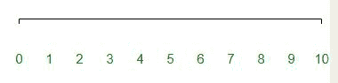
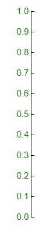

# D3.js 轴. tickPadding()函数

> 原文:[https://www . geesforgeks . org/D3-js-axis-tick padding-function/](https://www.geeksforgeeks.org/d3-js-axis-tickpadding-function/)

D3.js 中的 **d3.axis.tickPadding()函数**用于将填充设置为以像素为单位的指定值，并返回轴。

**语法:**

```
axis.tickPadding([padding])

```

**参数:**该函数接受如上所述的单个参数，如下所述:

*   **填充:**此参数是设置填充的大小。

**返回值:**该函数返回坐标轴。

下面的程序说明了 D3.js 中的 **d3.axis.tickPadding()** 函数:

**例 1:**

## 超文本标记语言

```
<!DOCTYPE html> 
<html> 

<head> 
    <title> 
        D3.js | D3.axis.tickPadding() Function 
    </title> 

    <script type="text/javascript" 
        src="https://d3js.org/d3.v4.min.js"> 
    </script> 

    <style> 
        svg text { 
            fill: green; 
            font: 15px sans-serif; 
            text-anchor: middle; 
        } 
    </style> 
</head> 

<body> 
    <script> 
        var width = 400, height = 400; 
        var svg = d3.select("body") 
            .append("svg") 
            .attr("width", width) 
            .attr("height", height); 

        var yscale = d3.scaleLinear() 
            .domain([0, 1]) 
            .range([height - 50, 0]); 

        var y_axis = d3.axisRight() 
            .scale(yscale).tickPadding([-20]);

        svg.append("g") 
            .attr("transform", "translate(100,20)") 
            .call(y_axis)  
    </script> 
</body> 
</html>
```

**输出:**



**例 2:**

## 超文本标记语言

```
<!DOCTYPE html> 
<html> 

<head> 
    <title> 
        D3.js | D3.axis.tickPadding() Function 
    </title> 

    <script type="text/javascript" 
        src="https://d3js.org/d3.v4.min.js"> 
    </script> 

    <style> 
        svg text { 
            fill: green; 
            font: 15px sans-serif; 
            text-anchor: middle; 
        } 
    </style> 
</head> 

<body> 
    <script> 
        var width = 400, height = 400; 
        var svg = d3.select("body") 
            .append("svg") 
            .attr("width", width) 
            .attr("height", height); 

        var xscale = d3.scaleLinear() 
            .domain([0, 10]) 
            .range([0, width - 60]); 

        var x_axis = d3.axisBottom() 
            .scale(xscale).tickPadding([40]).tickSizeInner([0]);

        var xAxisTranslate = height / 2; 

        svg.append("g") 
            .attr("transform", "translate(50, " 
                + xAxisTranslate + ")") 
            .call(x_axis)  
    </script>
</body> 
</html>
```

**输出:**

