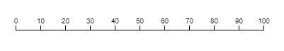
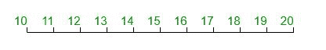

# D3 . js axis stop()功能

> 原文:[https://www.geeksforgeeks.org/d3-js-axistop-function/](https://www.geeksforgeeks.org/d3-js-axistop-function/)

轴可以使用内置的 D3 函数绘制。它由线条、记号和标签组成。D3.js 中的**D3 . axis stop()函数**用于创建顶部水平轴。这个函数将为给定的刻度构造一个新的面向顶部的轴生成器，带有空的刻度参数，刻度大小为 6，填充为 3。

Axis API 可以使用以下脚本进行配置。

```
<script src = "https://d3js.org/d3-axis.v1.min.js"></script>

```

**语法:**

```
d3.axisTop(scale)

```

**参数:**该函数只接受一个参数，如上所述，如下所述:

*   **刻度:**此参数为使用的刻度。

**返回值:**该函数返回一个顶部横轴。

下面的程序说明了 D3.js 中的 **d3.axisTop()** 功能:

**例 1:**

## 超文本标记语言

```
<!DOCTYPE html>
<html>

<head>
    <title>
        D3.js | d3.axisTop() Function
    </title>
    <script type="text/javascript" 
        src="https://d3js.org/d3.v4.min.js">
    </script>
</head>

<body>
    <script>
        var width = 400, height = 400;
        var svg = d3.select("body")
            .append("svg")
            .attr("width", width)
            .attr("height", height);

        var xscale = d3.scaleLinear()
            .domain([0, 100])
            .range([0, width - 50]);

        var x_axis = d3.axisTop(xscale);

        svg.append("g")
            .attr("transform", "translate(20,100)")
            .call(x_axis)
    </script>
</body>

</html>
```

**输出:**



**例 2:**

## 超文本标记语言

```
<!DOCTYPE html>
<html>

<head>
    <title>
        D3.js | d3.axisTop() Function
    </title>

    <script type="text/javascript" 
        src="https://d3js.org/d3.v4.min.js">
    </script>

    <style>
        svg text {
            fill: green;
            font: 15px sans-serif;
            text-anchor: end;
        }
    </style>
</head>

<body>
    <script>
        var width = 400, height = 400;
        var data = [10, 12, 14, 16, 18, 20];
        var svg = d3.select("body")
            .append("svg")
            .attr("width", width)
            .attr("height", height);

        var xscale = d3.scaleLinear()
            .domain([d3.min(data), d3.max(data)])
            .range([0, width - 60]);

        var x_axis = d3.axisTop(xscale);

        var xAxisTranslate = height / 2;

        svg.append("g")
            .attr("transform", "translate(50, "
            + xAxisTranslate + ")")
            .call(x_axis)
    </script>
</body>

</html>
```

**输出:**



**参考:**T2**https://devdocs.io/d3~5/d3-axis#axisTop**T5】