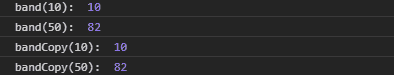
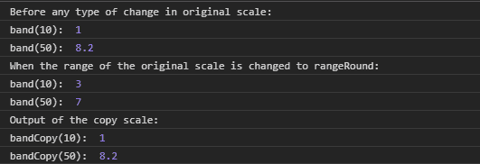

# D3 . js . band . copy()功能

> 原文:[https://www.geeksforgeeks.org/d3-js-band-copy-function/](https://www.geeksforgeeks.org/d3-js-band-copy-function/)

**band.copy()** 函数用于构造并返回具有相同域和范围的当前比例的副本。对任何比例进行的任何更改都是相互独立的，即原始比例的更改不会影响副本比例，反之亦然。

**语法:**

```
band.copy();
```

**参数:**此功能不接受任何参数。

**返回值:**该函数返回当前刻度的副本。返回类型是一个函数。

下面是上面给出的函数的几个例子。

**例 1:**

```
<!DOCTYPE html> 
<html lang = "en"> 
<head> 
    <meta charset = "UTF-8" /> 
    <meta name = "viewport"
        path1tent = "width=device-width, 
        initial-scale = 1.0"/> 
    <script src =
    "https://d3js.org/d3.v4.min.js">
    </script>

</head> 
<body> 
    <script> 
    // Creating the band scale 
    //with specified domain and range.
        var band = d3.scaleBand()
                    .domain([10, 20, 30, 40, 50])
                    .range([10, 100]);
    // Discrete values are automatically created 
    // By the band function
    // Band of the range is [10, 100]
        console.log("band(10): ", band(10));
        console.log("band(50): ", band(50));

        var bandCopy = band.copy();
        console.log("bandCopy(10): ", bandCopy(10));
        console.log("bandCopy(50): ", bandCopy(50));
    </script> 
</body> 
</html>
```

**输出:**



**例 2:**

```
<!DOCTYPE html> 
<html lang = "en"> 
<head> 
    <meta charset = "UTF-8" /> 
    <meta name = "viewport"
        path1tent = "width=device-width, 
        initial-scale = 1.0"/> 
    <title>GeekforGeeks</title> 
    <script src =
    "https://d3js.org/d3.v4.min.js">
    </script>

</head> 
<body> 
    <script> 
    // Creating the band scale
  // with specified domain and range.
        var band = d3.scaleBand()
                .domain([10, 20, 30, 40, 50])
                .range([1, 10]);
// Discrete values are automatically created 
    // By the band function
    // Band of the range is [1, 10]
        console.log(
"Before any type of change in original scale:");
        console.log("band(10): ", band(10));
        console.log("band(50): ", band(50));
        // Making copy of the original scale
        var bandCopy = band.copy();
        console.log(
"When the range of the original "+
"scale is changed to rangeRound:");
        // Making changes to the original scale
        band.rangeRound([1, 10]);
        console.log("band(10): ", band(10));
        console.log("band(50): ", band(50));
        console.log("Output of the copy scale:");
        console.log("bandCopy(10): ", bandCopy(10));
        console.log("bandCopy(50): ", bandCopy(50));
    </script> 
</body> 
</html>
```

**输出:**

