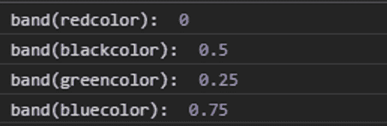
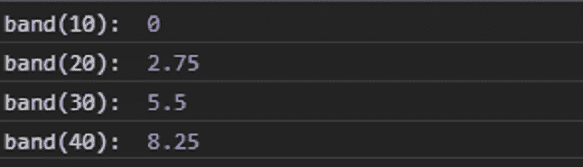

# D3.js band.domain()函数

> 原文:[https://www.geeksforgeeks.org/d3-js-band-domain-function/](https://www.geeksforgeeks.org/d3-js-band-domain-function/)

**d3.js** 中的 **band.domain()** 功能用于设置刻度的范围。域中出现的第一个值将被映射到范围数组中的第一个波段，依此类推。

**语法:**

```
band.domain([domain]);
```

**参数:**该功能接受上面给出的和下面描述的单个参数。

*   **域:**该参数设置标度的域，即最小值和最大值。

**返回值:**这个函数不返回任何东西。

**例 1:**

## 超文本标记语言

```
<!DOCTYPE html> 
<html lang = "en"> 
<head> 
    <meta charset = "UTF-8" /> 
    <meta name = "viewport"
        path1tent = "width=device-width, 
        initial-scale = 1.0"/> 
     <script src=
        "https://d3js.org/d3.v4.min.js">
    </script>    
</head> 

<body> 
    <script> 
      // Create band scale with domain
      // and range
      var band = d3.scaleBand()

      // Setting domain for the scale
      .domain(["redcolor", "greencolor",
             "blackcolor", "bluecolor"]);

      console.log("band(redcolor): ",
              band("redcolor"));
      console.log("band(blackcolor): ",
              band("blackcolor"));
      console.log("band(greencolor): ",
              band("greencolor"));
      console.log("band(bluecolor): ", 
              band("bluecolor"));                        
    </script> 
</body> 
</html>
```

**输出:**



**例 2:**

## 超文本标记语言

```
<!DOCTYPE html> 
<html lang = "en"> 
<head> 
    <meta charset = "UTF-8" /> 
    <meta name = "viewport"
        path1tent = "width=device-width, 
        initial-scale = 1.0"/> 

    <script src =
      "https://d3js.org/d3.v4.min.js">
    </script>
</head> 

<body> 
    <script> 
        // Creating the band scale with
        // specified domain and range.
        var band = d3.scaleBand()

        // Setting domain for the scale
                 .domain([10, 20, 30, 40])
                 .range([0, 11]);

        console.log("band(10): ", band(10));
        console.log("band(20): ", band(20));
        console.log("band(30): ", band(30));
        console.log("band(40): ", band(40));
    </script> 
</body> 
</html>
```

**输出:**

