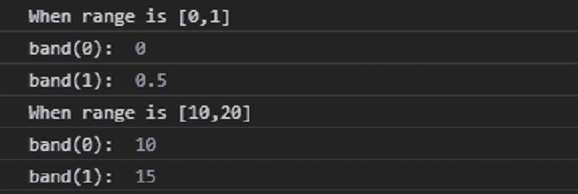
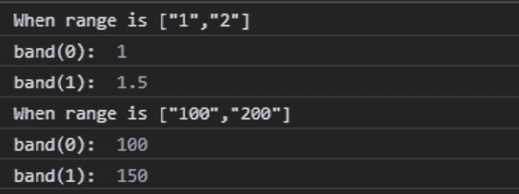

# D3.js 波段范围()功能

> 原文:[https://www.geeksforgeeks.org/d3-js-band-range-function/](https://www.geeksforgeeks.org/d3-js-band-range-function/)

**D3.js** 库中的 **band.range()** 功能用于将刻度范围设置为指定的二元数字数组。该范围的默认值为[0，1]。

**语法:**

```
  band.range([range]);

```

**参数:**该功能接受上面给出的和下面描述的单个参数。

*   **范围:**此参数接受两个元素的数字数组。

**注意:**如果范围内的元素不是数字，那么它们被强制为数字。

**返回值:**这个函数不返回任何东西。

下面是上面给出的函数的几个例子。

**例 1:**

## 超文本标记语言

```
<!DOCTYPE html>
<html lang="en">

<head>
    <meta charset="UTF-8" />
    <meta name="viewport" path1tent=
        "width=device-width, initial-scale = 1.0" />

    <script src="https://d3js.org/d3.v4.min.js">
    </script>
</head>

<body>
    <script>
        // Create the band scale with specified
        // domain and range.
        var band = d3.scaleBand()
            .domain([0, 1])
            .range([0, 1]);

        console.log("When range is [0, 1]");
        console.log("band(0): ", band(0));
        console.log("band(1): ", band(1));

        var band = d3.scaleBand()
            .domain([0, 1])
            .range([10, 20]);

        console.log("When range is [10, 20]");
        console.log("band(0): ", band(0));
        console.log("band(1): ", band(1));
    </script>
</body>

</html>
```

**输出:**



**例 2:**

## 超文本标记语言

```
<!DOCTYPE html>
<html lang="en">

<head>
    <meta charset="UTF-8" />
    <meta name="viewport" path1tent=
        "width=device-width, initial-scale = 1.0" />

    <script src="https://d3js.org/d3.v4.min.js">
    </script>
</head>

<body>
    <script>
        // Create the band scale with specified 
        // domain and range.
        var band = d3.scaleBand()
            .domain([0, 1])
            // These chars are coerced to numbers
            .range(["1", "2"]);

        console.log("When range is [\"1\", \"2\"]");
        console.log("band(0): ", band(0));
        console.log("band(1): ", band(1));

        var band = d3.scaleBand()
            .domain([0, 1])
            // These chars are coerced to numbers
            .range(["100", "200"]);

        console.log("When range is [\"100\", \"200\"]");
        console.log("band(0): ", band(0));
        console.log("band(1): ", band(1));
    </script>
</body>

</html>
```

**输出:**

