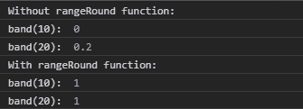
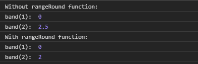

# D3.js band.rangeRound()函数

> 原文:[https://www . geesforgeks . org/D3-js-band-range round-function/](https://www.geeksforgeeks.org/d3-js-band-rangeround-function/)

**band.rangeRound()** 函数用于将刻度范围设置为指定的二元数组，同时也将 Round 设置为 true。

**语法:**

```
band.rangeRound([range]) 
```

**参数:**该功能接受以上给出的单个参数，描述如下:

*   **范围:**此参数接受两个元素的数字数组。

**返回值:**这个函数不返回任何东西。

下面是上面给出的函数的几个例子。

**例 1:**

```
<!DOCTYPE html> 
<html lang = "en"> 
<head> 
    <meta charset = "UTF-8" /> 
    <meta name = "viewport"
        path1tent = "width=device-width, 
        initial-scale = 1.0"/> 
    <script src =
    "https://d3js.org/d3.v4.min.js">
    </script>

</head> 
<body> 
    <script> 
    // Creating the band scale with
    // specified domain and range.
        var band = d3.scaleBand()
                    .domain([10, 20, 30, 40, 50])
                    .range([0, 1]);

        console.log("Without rangeRound function:");
        console.log("band(10): ", band(10));
        console.log("band(20): ", band(20));

        console.log("With rangeRound function:");

        var band = d3.scaleBand()
                    .domain([10, 20, 30, 40, 50])
                    .rangeRound([0, 1]);

        console.log("band(10): ", band(10));
        console.log("band(20): ", band(20));
    </script> 
</body> 
</html>
```

**输出:**



**例 2:**

```
<!DOCTYPE html> 
<html lang = "en"> 
<head> 
    <meta charset = "UTF-8" /> 
    <meta name = "viewport"
        path1tent = "width=device-width, 
        initial-scale = 1.0"/> 
    <script src =
    "https://d3js.org/d3.v4.min.js">
    </script>

</head> 
<body> 
    <script> 
    // Creating the band scale with
     // specified domain and range.
        var band = d3.scaleBand()
                    .domain([1, 2, 3, 4])
        // When range is in string
                    .range(["0", "10"]);
        console.log("Without rangeRound function:");
        console.log("band(1): ", band(1));
        console.log("band(2): ", band(2));

        console.log("With rangeRound function:");

        var band = d3.scaleBand()
                    .domain([1, 2, 3, 4, 5])
                    .rangeRound(["0", "10"]);

        console.log("band(1): ", band(1));
        console.log("band(2): ", band(2));
    </script> 
</body> 
</html>
```

**输出:**

