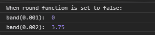
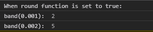

# D3.js band.round()函数

> 原文:[https://www.geeksforgeeks.org/d3-js-band-round-function/](https://www.geeksforgeeks.org/d3-js-band-round-function/)

**band.round()** 功能用于设置舍入的真或假，即启用或禁用舍入。如果四舍五入为真，那么每个波段的起点和终点将是一个整数。

**语法:**

```
band.round([round]);
```

**参数:**该功能接受以上给出的单个参数，描述如下:

*   **round:** 此参数接受真或假的布尔值。

**返回值:**这个函数不返回任何东西。

下面是上面给出的函数的几个例子。

**例 1:**

```
<!DOCTYPE html> 
<html lang = "en"> 
<head> 
    <meta charset = "UTF-8" /> 
    <meta name = "viewport"
        path1tent = "width=device-width, 
        initial-scale = 1.0"/> 
    <script src =
    "https://d3js.org/d3.v4.min.js">
    </script>

</head> 
<body> 
    <script> 
    // Creating the band scale with
    // specified domain and range.
        var band = d3.scaleBand()
          .domain([0.001, 0.002, 0.003, 0.004])
        // When range is in string
                    .range(["0", "15"]);

console.log("When round function is set to false:");
      // Setting round to false
        band.round(false);

        console.log("band(0.001): ", band(0.001));
        console.log("band(0.002): ", band(0.002));
    </script> 
</body> 
</html>
```

**输出:**



**例 2:**

```
<!DOCTYPE html> 
<html lang = "en"> 
<head> 
    <meta charset = "UTF-8" /> 
    <meta name = "viewport"
        path1tent = "width=device-width, 
        initial-scale = 1.0"/> 
    <script src =
    "https://d3js.org/d3.v4.min.js">
    </script>
</head> 
<body> 
    <script> 
    // Creating the band scale with 
   //specified domain and range.
        var band = d3.scaleBand()
   .domain([0.001, 0.002, 0.003, 0.004])
        // When range is in string
                    .range(["0", "15"]);

 console.log("When round function is set to true:");
      // Setting round to true
        band.round(true);

        console.log("band(0.001): ", band(0.001));
        console.log("band(0.002): ", band(0.002));
    </script> 
</body> 
</html>
```

**输出:**

