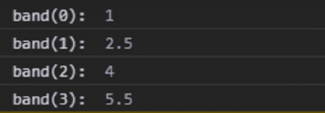

# D3.js bandScale band()函数

> 原文:[https://www . geesforgeks . org/D3-js-bandscale-band-function/](https://www.geeksforgeeks.org/d3-js-bandscale-band-function/)

**d3.js** 库中的**波段()**功能用于从对应于给定输入域的范围返回波段的起点。

**语法:**

```
band(value);
```

**参数:**该函数采用一个参数，如上所述，如下所述。

*   **值:**接受来自指定域的值。

**返回值:**该函数返回指定范围内的值。

**示例:**以下示例演示了上述功能。

## 超文本标记语言

```
<!DOCTYPE html>
<html lang="en">

<head>
    <meta charset="UTF-8" />
    <meta name="viewport" path1tent=
        "width=device-width, initial-scale = 1.0" />
    <script src="https://d3js.org/d3.v4.min.js">
    </script>
</head>

<body>
    <script>
        // Create the band scale with 
        // specified domain and range.
        var band = d3.scaleBand()
            .domain([0, 1, 2, 3, 4, 5])
            .range([1, 10]);

        // Discrete values are automatically 
        // created by the band function
        // band of the range is [1, 10]
        console.log("band(0): ", band(0));
        console.log("band(1): ", band(1));
        console.log("band(2): ", band(2));
        console.log("band(3): ", band(3));
    </script>
</body>

</html>
```

**输出:**

