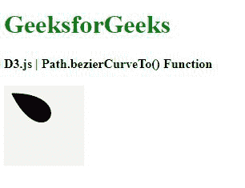

# D3 . js beziercerveto()功能

> 原文:[https://www.geeksforgeeks.org/d3-js-beziercurveto-function/](https://www.geeksforgeeks.org/d3-js-beziercurveto-function/)

d3.js 中的**D3 . beziercerveto()**函数用于通过某些控制点将三次贝塞尔曲线段从当前给定点绘制到某一点。

**语法:**

```
path.bezierCurveTo(cpx1, cpy1, cpx2, cpy2, x, y);
```

**参数:**该函数取以下参数。

*   **cpx1:** 是贝塞尔控制点的 x1 坐标。
*   **cpy1:** 是贝塞尔控制点的 y1 坐标。
*   **cpx2:** 是贝塞尔控制点的 x2 坐标。
*   **cpy2:** 是贝塞尔控制点的 y2 坐标。
*   **x:** 是端点的 x 坐标。
*   **y:** 是端点的 y 坐标。

**返回值:**该函数不返回值。

**例 1:**

## 超文本标记语言

```
<!DOCTYPE html>
<html lang="en">

<head>
    <meta charset="UTF-8">
    <meta name="viewport" path1tent=
        "width=device-width,initial-scale=1.0">

    <script src=
        "https://d3js.org/d3.v4.min.js">
    </script>

    <style>
        h1 {
            color: green;
        }

        svg {
            background-color: #f2f2f2;
        }

        .path2 {
            stroke: #000;
        }
    </style>
</head>

<body>
    <div>
        <h1>GeeksforGeeks</h1>
        <b>D3.js | Path.bezierCurveTo() Function</b>
        <br><br>
        <svg width="100" height="100">
            <path class="path2">
        </svg>
    </div>

    <script>

        // Creating a path 
        var path = d3.path();
        path.moveTo(10, 10);
        path.bezierCurveTo(95, 10, 50, 90, 10, 10)

        // Closing the path 
        path.closePath();
        d3.select(".path2").attr("d", path); 
    </script>
</body>

</html>
```

**输出:**



**例 2:**

## 超文本标记语言

```
<!DOCTYPE html>
<html lang="en">

<head>
    <meta charset="UTF-8">
    <meta name="viewport" path1tent=
        "width=device-width,initial-scale=1.0">

    <script src=
        "https://d3js.org/d3.v4.min.js">
    </script>

    <style>
        h1 {
            color: green;
        }

        svg {
            background-color: #f2f2f2;
        }

        .path2 {
            stroke: #000;
        }
    </style>
</head>

<body>
    <div>
        <h1>GeeksforGeeks</h1>
        <b>D3.js | Path.bezierCurveTo() Function</b>
        <br><br>
        <svg width="100" height="100">
            <path class="path2">
        </svg>
    </div>

    <script>

        // Creating a path 
        var path = d3.path();
        path.moveTo(10, 10);
        path.bezierCurveTo(95, 10, 50, 90, 10, 10)

        // Closing the path 
        path.closePath();
        path.bezierCurveTo(90, 10, 15, 110, 10, 10)

        // Closing the path 
        path.closePath();
        d3.select(".path2").attr("d", path); 
    </script>
</body>

</html>
```

**输出:**

