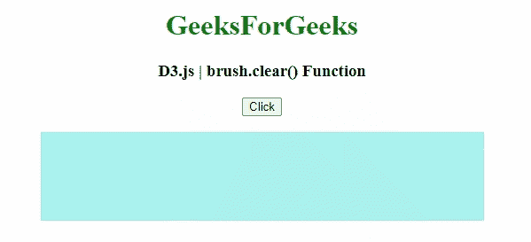
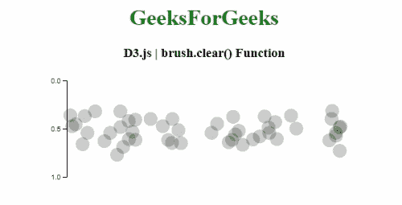

# D3.js brush.clear()功能

> 原文:[https://www.geeksforgeeks.org/d3-js-brush-clear-function/](https://www.geeksforgeeks.org/d3-js-brush-clear-function/)

**D3.js** 中的**笔刷. clear()** 功能用于在指定的组中设置笔刷的活动选择。这是 brush.move 的别名，带有空选择。

**语法:**

```
brush.clear(group);
```

**参数:**该函数接受一个参数，如上所述，如下所述

*   **组:**该参数是指定的实现画笔的组。

**返回值:**该函数返回定义该元素画笔选择的数组。

下面的程序说明了 **D3.js** 中的 **brush.clear()** 功能

**例 1:**

## 超文本标记语言

```
<!DOCTYPE html>  
<html>  

<head>  
    <script src=
        "https://d3js.org/d3.v5.min.js">
    </script> 
</head>  

<body>  
    <center>
        <h1 style="color:green;">GeeksForGeeks</h1>

        <h3>D3.js | brush.clear() Function  </h3>

        <button>Click</button>
        <br>
        <br>
        <svg width="500" height="100" 
             style="background-color: #aaf2ef;">
        </svg> 

        <script>  
            // Selecting SVG element 
            const svg = d3.select("svg");

            const g = svg.append("g");

            // Creating a brush using the  
            // d3.brush function 
            g.call(d3.brush());

            // Use of brush.move() function
            d3.select("button").on("click", function() {
                g.call(d3.brush().clear)
            });     
        </script>  
    </center>
</body>  

</html>
```

**输出:**



**例 2:**

## 超文本标记语言

```
<!DOCTYPE html>  
<html>  

<head>  
    <meta charset="utf-8">

    <script src=
        "https://d3js.org/d3.v4.min.js">
    </script> 

    <style>

        circle {
          fill-opacity: 0.2;
        }

        circle.active {
          fill-opacity: 0.8;
          stroke: red;
          fill: green;
        }

    </style>
</head>  

<body>  
    <center>
        <h1 style="color:green;">GeeksForGeeks</h1>

        <h3>D3.js | brush.clear() Function  </h3>

        <svg width="500" height="200"></svg>

        <script>  
            var data = d3.range(50).map(Math.random);

            var svg = d3.select("svg"),
                margin = {top: 10, right: 50,
                        bottom: 50, left: 50},
                width = +svg.attr("width") - 
                        margin.left - margin.right,
                height = +svg.attr("height") - 
                        margin.top - margin.bottom,
                g = svg.append("g")
                    .attr("transform", "translate(" 
                    + margin.left + "," + margin.top + ")"
                    );

            var x = d3.scaleLinear().range([0, width]),
                y = d3.randomNormal(height / 2, height / 8),
                z = d3.scaleLinear().range([0, height]);

            var brush = d3.brushX()
                .extent([[0, 0], [width, height]])
                .on("start brush end", brushmoved);

            g.append("g")
                .attr("class", "axis axis--x")
                .attr("transform", "translate(0,0)")
                .call(d3.axisLeft(z).ticks(3));

            var circle = g.append("g")
                .attr("class", "circle")
                .selectAll("circle")
                .data(data)
                .enter().append("circle")
                .attr("transform", function (d) { 
                    return "translate(" 
                    + x(d) + "," + y() + ")"; 
                })
                .attr("r", 10);

            var gBrush = g.append("g")
                .attr("class", "brush")
                .call(brush);

            gBrush.call(brush.clear);

            var bs = "";
            function brushmoved() {
              var s = d3.event.selection;

              if (d3.event.type === "start"){
                bs = d3.event.selection;
              } 
              else if (d3.event.type === "end"){

                if (bs[0] !== s[0] && bs[1] !== s[1]) {
                  console.log('moved both');
                } 
                else if (bs[0] !== s[0]) {
                  console.log('moved left');
                } 
                else {
                  console.log('moved right');
                }
              }

              if (s == null) {
                handle.attr("display", "none");
                circle.classed("active", false);
              } 
              else {
                var sx = s.map(x.invert);
                circle.classed("active", function (d) {
                    return sx[0] <= d && d <= sx[1]; 
                });
                handle.attr("display", null)
                .attr("transform", function (d, i) {
                    return "translate("
                    + s[i] + "," + height / 2 + ")"; 
                });
              }
            }

        </script>  
    </center>
</body>  

</html>
```

**输出:**

