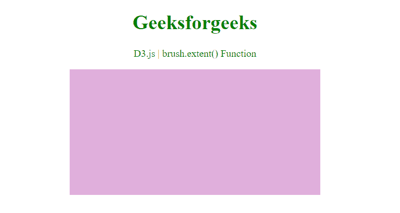
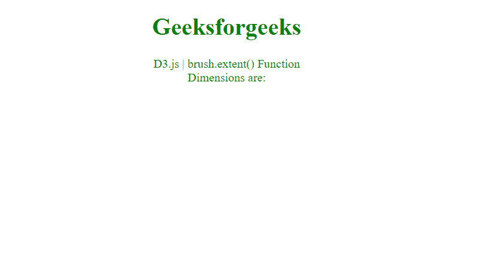

# D3.js 笔刷. extent()函数

> 原文:[https://www.geeksforgeeks.org/d3-js-brush-extent-function/](https://www.geeksforgeeks.org/d3-js-brush-extent-function/)

**D3.js** 中的**brush . extension()**功能用于将可刷范围设置为指定的点数组[[]T6]x0， *y0* ]，[ *x1* ， *y1* ]，其中【T22】x0

**语法:**

```
brush.extent([extent]);

```

**参数:**该函数接受一个参数，如上所述，如下所述

*   **范围:**该参数决定了不可见覆盖的大小，也约束了笔刷选择

**返回值:**此函数返回画笔。

下面的程序说明了 **D3.js** 中的**笔刷. extent()** 功能

**例 1:**

## 超文本标记语言

```
<!DOCTYPE html> 
<html> 

<head>
    <script src=
        "https://d3js.org/d3.v4.min.js"> 
    </script> 
</head> 

<body> 
    <center>
        <h1 style="color: green;"> 
            Geeksforgeeks 
        </h1> 

        <p style="color:green;"> 
            D3.js | brush.extent() Function <br> 
        </p>

        <svg width="400" height="200" id="brush">
        </svg> 

        <script> 
            // Selecting SVG element 
            d3.select("#brush") 

            // Creating a brush using the  
            // d3.brush function 
            .call( d3.brush()    

            // use of brush.extent() Function
            .extent( [ [0,0], [600,300] ] )

            )
            .style("fill", "#e0afdd");
        </script> 
    </center>
</body> 

</html>
```

**输出:**



**例 2:**

## 超文本标记语言

```
<!DOCTYPE html> 
<html> 

<head>
    <script src=
        "https://d3js.org/d3.v4.min.js"> 
    </script> 

</head> 

<body> 
    <center>
        <h1 style="color: green;"> 
            Geeksforgeeks 
        </h1> 

        <p style="color: green;"> 
            D3.js | brush.extent() Function <br> 
            Dimensions are:<br> 
        </p>

        <p id="p"></p>

        <svg width="600" height="600" id="brush">
        </svg> 

        <script> 
            // Selecting SVG element 
            d3.select("#brush")
            // Creating a brush 
            .call(d3.brush() 
            // Calling a function 
            // on brush change 
            .on("brush", geekBrush)
            // Use of brush.extent() Function
            .extent([[0, 0], [600, 300]]) 
            ); 

            function geekBrush() { 
                const sel = d3.brushSelection(this); 

                var p = document.getElementById("p"); 
                p.innerHTML = "X0 : " 
                  + sel[0][1] + `<br>`  
                  + "X1 : " + sel[1][1]  
                  + `<br>` + "Y0 : " 
                  + sel[0][0] + `<br>` 
                  + "Y1 : " + sel[1][0] + `<br>`; 
            } 
        </script> 
    </center>
</body> 

</html>
```

**输出:**

