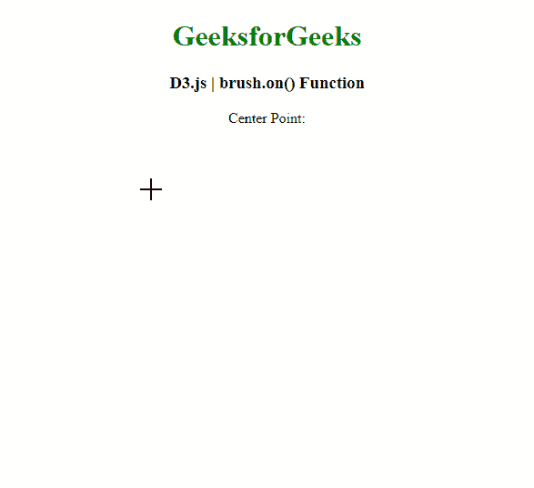
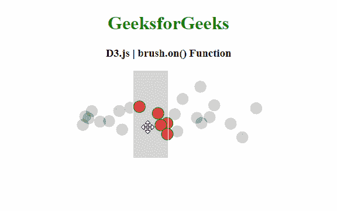

# D3.js 刷机()功能

> 原文:[https://www.geeksforgeeks.org/d3-js-brush-on-function/](https://www.geeksforgeeks.org/d3-js-brush-on-function/)

**D3.js** 中的 **brush.on()** 功能用于为指定的类型名设置事件监听器并返回 brush。

**语法:**

```
brush.on( typenames, listener )
```

**参数:**该函数接受两个参数，如上所述，如下所述:

*   **类型名:**是包含一个或多个由空格分隔的类型名的字符串。
*   **侦听器:**它是用作指定类型名的事件侦听器的函数。这是一个可选参数。

**返回值:**该函数返回要使用的画笔。

下面的程序说明了 **D3.js:** 中的 **brush.on()** 功能

**例 1:**

## 超文本标记语言

```
<!DOCTYPE html>
<html>
<head>
  <script src=
"https://d3js.org/d3.v4.min.js">
  </script>
</head>
<body>
  <center>
    <h1 style="color: green;">
      GeeksforGeeks
    </h1>

    <h3>D3.js | brush.on() Function </h3>

    <p style="color: green;">Center Point:</p>

    <p style="color: green;" id="p"></p>

    <svg width="300" height="300" id="brush">
    </svg>

    <script>
      // Select the SVG element 
      d3.select("#brush")

        // Create a brush 
        .call(d3.brush()

          // Use the brush.on() function
          // to set the given event listener
          .on("brush", geekBrush)
          .extent([[0, 0],
          [300, 300]]
          )
        );

      function geekBrush() {
        const sel = d3.brushSelection(this);

        // Select the paragraph element
        var p = document.getElementById("p");

        // Calculate the center point
        // to be displayed
        var pt1 = sel[1][0] - sel[0][0];
        var pt2 = sel[1][1] - sel[0][1];

        p.innerHTML = "( "
          + pt1 + ", " + pt2 + " )";
      } 
    </script>
  </center>
</body>
</html>
```

**输出:**



**例 2:**

## 超文本标记语言

```
<!DOCTYPE html>
<html>
<head>
  <script src=
"https://d3js.org/d3.v4.min.js">
  </script>
  <style>
    circle {
      fill-opacity: 0.2;
    }

    circle.active {
      fill-opacity: 0.8;
      stroke: green;
      fill: red;
    }
  </style>
</head>

<body>
  <center>
    <h1 style="color:green;">GeeksforGeeks</h1>
    <h3>D3.js | brush.on() Function </h3>

    <svg width="400" height="200"></svg>

    <script>
      var data = d3.range(25).map(Math.random);

      // Select the SVG element 
      var svg = d3.select("svg"),
        margin = {
          top: 0, right: 50,
          bottom: 50, left: 50
        },
        width = svg.attr("width") -
          margin.left - margin.right,
        height = svg.attr("height") -
          margin.top - margin.bottom,
        g = svg.append("g")
          .attr("transform", "translate("
            + margin.left + "," + margin.top + ")"
          );

      var x = d3.scaleLinear().range([0, width]),
        y = d3.randomNormal(height / 2, height / 8);

      var brush = d3.brushX()
        // Use the brush.on() function
        // to set the given event listener
        .on("start brush end", brushmoved)

        .extent([[0, 0], [width, height]]);

      var circle = g.append("g")
        .attr("class", "circle")
        .selectAll("circle")
        .data(data)
        .enter().append("circle")
        .attr("transform", function (d) {
          return "translate("
            + x(d) + "," + y() + ")";
        })
        .attr("r", 10);

      var gBrush = g.append("g")
        .attr("class", "brush")
        .call(brush);

      gBrush.call(brush.move, [0.3, 0.5].map(x));

      var bs = "";

      // Define the function to be
      // called when the brush is moved
      function brushmoved() {
        var s = d3.event.selection;

        if (s == null) {
          handle.attr("display", "none");
          circle.classed("active", false);
        } else {
          var sx = s.map(x.invert);
          circle.classed("active", function (d) {
            return sx[0] <= d && d <= sx[1];
          });
          handle.attr("display", null)
            .attr("transform", function (d, i) {
              return "translate("
                + s[i] + "," + height / 2 + ")";
            });
        }
      }
    </script>
  </center>
</body>
</html>
```

**输出:**

