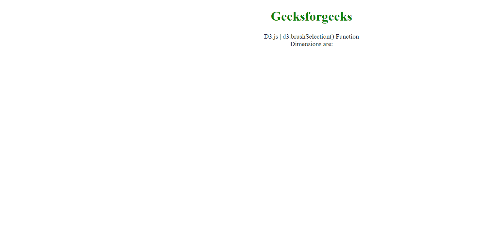

# D3.js 涂刷选举()功能

> 原文:[https://www . geesforgeks . org/D3-js-branch election-function/](https://www.geeksforgeeks.org/d3-js-brushselection-function/)

D3.js 中的**D3 . brusheelection()函数**用于获取给定节点的画笔选择。

**语法:**

```
d3.brushSelection(this);
```

**参数:**

*   **这个:**用来获取当前画笔的边界。

**返回值:**这个函数返回包含画笔元素边界的数组。

**示例:**在本例中，我们将创建一个笔刷，并将使用此方法获得其选择绑定边。

```
<!DOCTYPE html>
<html>
    <head>
        <title>
            D3.js | d3.brushSelection() Function
        </title>

        <script src="https://d3js.org/d3.v4.min.js">
       </script>
    </head>

    <body>
        <h1 style="color: green;
                   text-align: center;">
            Geeksforgeeks
        </h1>

        <p style="text-align: center;">
            D3.js | d3.brushSelection() Function <br />
            Dimensions are:<br />
        </p>

        <p style="text-align: center;" 
           id="p"></p>

        <svg width="600" 
             height="600" 
             id="brush"></svg>
        <script>
            // Selecting SVG element
            d3.select("#brush")
                // Creating a brush
                .call(
                    d3
                        .brush()
                 // Calling a function on brush change
                        .on("brush", brushed)

         /* Initialise the brush area: start at 0, 0 
         and finishes at given width, height*/
                        .extent([
                            [0, 0],
                            [600, 600],
                        ])
                );
            function brushed() {
// Using d3.brushSelection to get bounds of the brush
                const sel = d3.brushSelection(this);
                console.log(sel);
                var p = document.getElementById("p");
                p.innerHTML = "side1 : " 
                  + sel[0][1] + `<br>` 
                  + "side2 : " + sel[1][1] 
                  + `<br>` + "side3 : " 
                  + sel[0][0] + `<br>`
                  + "side4 : " + sel[1][0] + `<br>`;
            }
        </script>
    </body>
</html>
```

**输出:**

