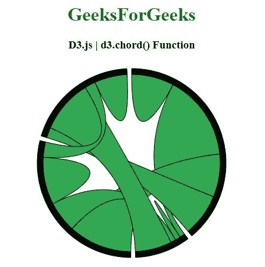
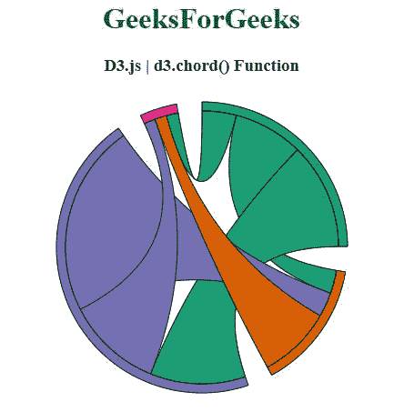

# D3.js 和弦()功能

> 原文:[https://www.geeksforgeeks.org/d3-js-chord-function/](https://www.geeksforgeeks.org/d3-js-chord-function/)

**D3.js** 中的 **d3.chord()** 功能用于返回默认设置下构造的新和弦布局。

**语法:**

```
d3.chord()

```

**参数:**此功能不接受任何参数。

**返回值:**该函数返回构造的新和弦布局。

以下程序说明了 D3.js 中的 **d3.chord()** 功能:

**例 1:**

## 超文本标记语言

```
<!DOCTYPE html>
<html>
<head>
  <script src=
"https://d3js.org/d3.v4.min.js">
  </script>
</head>
<body>
  <center>
    <h1 style="color:green;">GeeksForGeeks</h1>

    <h3>D3.js | d3.chord() Function</h3>
    <div id="GFG"></div>

    <script>
      // Create the svg area
      var svg = d3.select("#GFG")
        .append("svg")
        .attr("width", 340)
        .attr("height", 340)
        .append("g")
        .attr("transform", "translate(170,170)")

      // Create input data
      var data = [[8010, 16145, 8090, 8045],
      [1013, 990, 940, 6907],
      [11975, 5871, 8916, 2868],
      [1951, 10048, 2060, 6171]];

      // Give this matrix to d3.chord()
      var chords = d3.chord()
        .padAngle(0.05)
        (data)

      // Add the groups on the inner part 
      // of the circle
      svg.datum(chords)
        .append("g")
        .selectAll("g")
        .data(function (d) { return d.groups; })
        .enter()
        .append("g")
        .append("path")
        .style("fill", "black")
        .style("stroke", "black")
        .attr("d", d3.arc()
          .innerRadius(150)
          .outerRadius(160)
        )

      // Add the links between groups
      svg.datum(chords)
        .append("g")
        .selectAll("path")
        .data(function (d) { return d; })
        .enter()
        .append("path")
        .attr("d", d3.ribbon()
          .radius(150)
        )
        .style("fill", "#32a852")
        .style("stroke", "black");
    </script>
  </center>
</body>
</html>
```

**输出:**



**例 2:**

## 超文本标记语言

```
<!DOCTYPE html>
<html>
<head>
  <script src=
"https://d3js.org/d3.v4.min.js">
  </script>
  <script src=
"https://d3js.org/d3-color.v1.min.js">
  </script>
  <script src=
"https://d3js.org/d3-interpolate.v1.min.js">
  </script>
  <script src=
"https://d3js.org/d3-scale-chromatic.v1.min.js">
  </script>
</head>
<body>
  <center>
    <h1 style="color:green;">GeeksForGeeks</h1>

    <h3>D3.js | d3.chord() Function</h3>
    <div id="GFG"></div>

    <script>
      // Create the svg area
      var svg = d3.select("#GFG")
        .append("svg")
        .attr("width", 340)
        .attr("height", 340)
        .append("g")
        .attr("transform", "translate(170,170)")

      // Create input data
      var data = [[0, 5871, 8916, 2868],
      [1951, 0, 2060, 6171],
      [8010, 16145, 0, 8045],
      [1013, 990, 940, 0]];

      // 4 groups, so create a vector of 4 colors
      var colors =
          [d3.schemeDark2[0], d3.schemeDark2[1],
           d3.schemeDark2[2], d3.schemeDark2[3]];

      // Give this matrix to d3.chord()
      var chords = d3.chord()
        .padAngle(0.175)
        .sortSubgroups(d3.ascending)
        (data)

      // Add the groups on the inner part 
      // of the circle
      svg.datum(chords)
        .append("g")
        .selectAll("g")
        .data(function (d) { return d.groups; })
        .enter()
        .append("g")
        .append("path")
        .style("fill", function (d, i) {
          return colors[i]
        })
        .style("stroke", "black")
        .attr("d", d3.arc()
          .innerRadius(150)
          .outerRadius(160)
        )

      // Add the links between groups
      svg.datum(chords)
        .append("g")
        .selectAll("path")
        .data(function (d) { return d; })
        .enter()
        .append("path")
        .attr("d", d3.ribbon()
          .radius(150)
        )
        .style("fill", function (d) {
          return (colors[d.source.index])
        })
        .style("stroke", "black");
    </script>
  </center>
</body>
</html>
```

**输出:**

