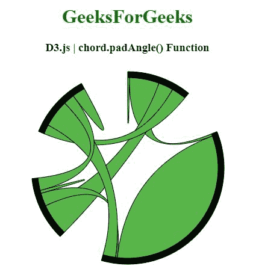
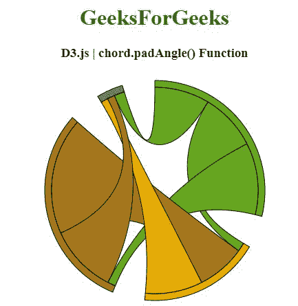

# D3.js 和弦. padAngle()功能

> 原文:[https://www . geesforgeks . org/D3-js-chord-pad angle-function/](https://www.geeksforgeeks.org/d3-js-chord-padangle-function/)

**D3.js** 中的 **chord.padAngle()** 功能用于将相邻组之间的 padAngle 设置为指定的弧度数，并返回和弦布局。

**语法:**

```
chord.padAngle([angle]);
```

**参数:**该函数接受一个参数，如上所述，如下所述

*   **角度:**该参数是设置相邻组之间焊盘角度的角度。

**返回值:**该函数返回和弦布局。

下面的程序说明了 **D3.js** 中的 **chord.padAngle()** 功能

**例 1:**

## 超文本标记语言

```
<!DOCTYPE html>
<html>

<head>
    <title>D3.js | chord.padAngle() Function</title>
    <meta charset="utf-8">
    <script src="https://d3js.org/d3.v4.js"></script>
</head>

<body>
    <center>
        <h1 style="color:green;">GeeksForGeeks</h1>

        <h3>D3.js | chord.padAngle() Function</h3>
        <div id="GFG"></div>

        <script>
            // Create the svg area
            var svg = d3.select("#GFG")
                .append("svg")
                .attr("width", 340)
                .attr("height", 340)
                .append("g")
                .attr("transform", "translate(170, 170)")

            // Create input data
            var data = [[10, 161, 80, 80],
            [13, 990, 9, 69],
            [175, 71, 16, 68],
            [51, 148, 60, 71]];

            // Give this matrix to d3.chord()
            var chords = d3.chord()

                // Use of chord.padAngle() Function
                .padAngle(0.5)
                (data)

            svg.datum(chords)
                .append("g")
                .selectAll("g")
                .data(function (d) { return d.groups; })
                .enter()
                .append("g")
                .append("path")
                .style("fill", "black")
                .style("stroke", "black")
                .attr("d", d3.arc()
                    .innerRadius(150)
                    .outerRadius(160)
                )

            svg.datum(chords)
                .append("g")
                .selectAll("path")
                .data(function (d) { return d; })
                .enter()
                .append("path")
                .attr("d", d3.ribbon()
                    .radius(150)
                )
                .style("fill", "#58b54a")
                .style("stroke", "black");
        </script>
    </center>
</body>

</html>
```

**输出:**



**例 2:**

## 超文本标记语言

```
<!DOCTYPE html>
<html>

<head>
    <title>D3.js | chord.padAngle() Function</title>
    <meta charset="utf-8">

    <script src="https://d3js.org/d3.v4.min.js"></script>
    <script src="https://d3js.org/d3-color.v1.min.js">
    </script>
    <script src=
        "https://d3js.org/d3-interpolate.v1.min.js">
    </script>
    <script src=
        "https://d3js.org/d3-scale-chromatic.v1.min.js">
    </script>
</head>

<body>
    <center>
        <h1 style="color:green;">GeeksForGeeks</h1>

        <h3>D3.js | chord.padAngle() Function</h3>
        <div id="GFG"></div>

        <script>
            // Create the svg area
            var svg = d3.select("#GFG")
                .append("svg")
                .attr("width", 340)
                .attr("height", 340)
                .append("g")
                .attr("transform", "translate(170, 170)")

            // Create input data
            var data = [[0, 71, 89, 68],
            [11, 0, 60, 71],
            [10, 145, 0, 85],
            [13, 9, 9, 0]];

            // 4 groups, so create a vector of 4 colors
            var colors = [d3.schemeDark2[4], d3.schemeDark2[5],
            d3.schemeDark2[6], d3.schemeDark2[7]];

            // Give this matrix to d3.chord()
            var chords = d3.chord()

                // Use of chord.padAngle() Function
                .padAngle(0.3)
                .sortSubgroups(d3.ascending)
                (data)

            svg.datum(chords)
                .append("g")
                .selectAll("g")
                .data(function (d) { return d.groups; })
                .enter()
                .append("g")
                .append("path")
                .style("fill", function (d, i) {
                    return colors[i]
                })
                .style("stroke", "black")
                .attr("d", d3.arc()
                    .innerRadius(150)
                    .outerRadius(160)
                )

            svg.datum(chords)
                .append("g")
                .selectAll("path")
                .data(function (d) { return d; })
                .enter()
                .append("path")
                .attr("d", d3.ribbon()
                    .radius(150)
                )
                .style("fill", function (d) {
                    return (colors[d.source.index])
                })
                .style("stroke", "black");
        </script>
    </center>
</body>

</html>
```

**输出:**

