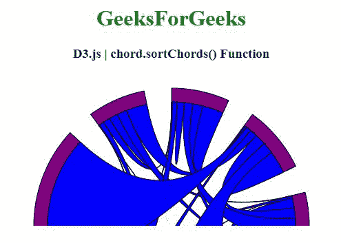
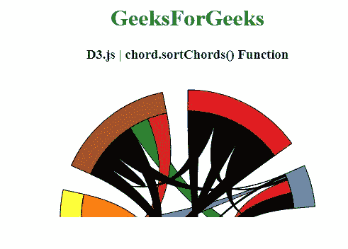

# D3 . js chord . sort chord()函数

> 原文:[https://www . geesforgeks . org/D3-js-chord-sort chord-function/](https://www.geeksforgeeks.org/d3-js-chord-sortchords-function/)

**D3.js** 中的**chord . sort chord()**功能用于将和弦比较器设置为指定功能或 null，并返回该和弦布局。

**语法:**

```
chord.sortChords(compare);

```

**参数:**该函数接受一个参数，如上所述，如下所述

*   **比较:**该参数是设置和弦比较器的功能。

**返回值:**该函数返回和弦布局。

下面的程序说明了 **D3.js** 中的**chord . sort chord()**功能

**例 1:**

## 超文本标记语言

```
<!DOCTYPE html> 
<html> 
<head>  
  <meta charset="utf-8">
  <script src="https://d3js.org/d3.v4.js"></script>
</head> 
<body>
  <center> 
    <h1 style="color:green;">GeeksForGeeks</h1>
    <h3>D3.js | chord.sortChords() Function</h3>
    <div id="GFG"></div>
    <script>
      // Create the svg area
      var svg = d3.select("#GFG")
          .append("svg")
          .attr("width", 440)
          .attr("height", 220)
          .append("g")
          .attr("transform", "translate(220,220)");

      // Create input data
      var data = [[51, 148, 60, 71, 34, 5, 1],
                  [ 10, 161, 80, 80, 12, 34, 53],
                  [175,  71, 16, 68, 0 , 0, 3],
                  [13, 990,  9, 69, 76, 35, 4],
                  [175,  71, 16, 68, 0 , 0, 3],
                  [13, 990,  9, 69, 76, 35, 4],
                  [51, 148, 60, 71, 34, 5, 1]];

      // Give this matrix to d3.chord()
      var chords = d3.chord()
          .padAngle(0.2) 
          .sortSubgroups(d3.ascending)

          // Use of chord.sortChords() Function
          .sortChords(d3.ascending)(data)

      svg.datum(chords)
          .append("g")
          .selectAll("g")
          .data(function (d) { return d.groups; })
          .enter()
          .append("g")
          .append("path")
          .style("fill", "purple")
          .style("stroke", "black")
          .attr("d", d3.arc()
              .innerRadius(170)
              .outerRadius(200)
              );

      svg.datum(chords)
          .append("g")
          .selectAll("path")
          .data(function (d) { return d; })
          .enter()
          .append("path")
          .attr("d", d3.ribbon()
              .radius(180)
              )
          .style("fill", "blue")
          .style("stroke", "black");
    </script> 
  </center>
</body> 
</html>
```

**输出:**



**例 2:**

## 超文本标记语言

```
<!DOCTYPE html> 
<html> 
<head>
  <meta charset="utf-8">
  <script src= 
       "https://d3js.org/d3.v4.min.js">
  </script>   
  <script src= 
      "https://d3js.org/d3-scale-chromatic.v1.min.js">
  </script>
</head> 
<body> 
    <center> 
    <h1 style="color:green;">GeeksForGeeks</h1>

    <h3>D3.js | chord.sortChords() Function</h3>
    <div id="GFG"></div>

    <script>
      // Create the svg area
      var svg = d3.select("#GFG")
          .append("svg")
          .attr("width", 400)
          .attr("height", 200)
          .append("g")
          .attr("transform", "translate(200,200)");

      // Create input data
      var data = [[0, 71, 89, 68, 71, 89, 68],
                  [ 11, 0, 60, 71, 9,  9, 0],
                  [ 10, 145, 0, 85, 145, 0, 85],
                  [ 13, 9,  9, 0, 0, 60, 71],
                  [ 13, 9,  9, 0, 0, 60, 71],
                  [ 10, 145, 0, 85, 145, 0, 85],
                  [0, 71, 89, 68, 71, 89, 68]];

      // 4 groups, so create a vector of 4 colors
      var colors_1 = [d3.schemeSet1[0], d3.schemeCategory10[1],
          d3.schemeCategory10[2], d3.schemeCategory10[3],
          d3.schemeCategory10[4], d3.schemeCategory10[5],
          d3.schemeCategory10[6]];

      var colors = [d3.schemeSet1[0], d3.schemeSet1[1],
          d3.schemeSet1[2], d3.schemeSet1[3],
          d3.schemeSet1[4], d3.schemeSet1[5],
          d3.schemeSet1[6]];

      // Give this matrix to d3.chord()
      var chords = d3.chord()
          .padAngle(0.2)
          .sortSubgroups(d3.ascending)

          // Use of chord.sortChords() Function
          .sortChords(d3.descending)(data)

      svg.datum(chords)
          .append("g")
          .selectAll("g")
          .data(function (d) { return d.groups; })
          .enter()
          .append("g")
          .append("path")
          .style("fill", function (d, i) {
              return colors[i] 
          })
          .style("stroke", "black")
          .attr("d", d3.arc()
              .innerRadius(150)
              .outerRadius(180)
          );

      svg.datum(chords)
          .append("g")
          .selectAll("path")
          .data(function (d) { return d; })
          .enter()
          .append("path")
          .attr("d", d3.ribbon()
              .radius(150)
              )
          .style("fill", function (d, i) {
              return colors_1[i] 
          })
          .style("stroke", "black");
    </script> 
  </center>
</body> 
</html>
```

**输出:**

