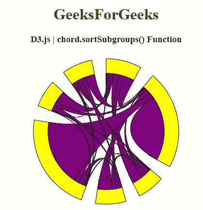
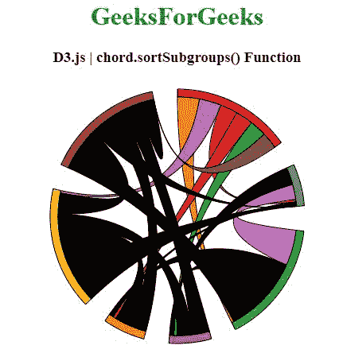

# D3 . js chord . sort subgroup()函数

> 原文:[https://www . geesforgeks . org/D3-js-chord-sort subgroup-function/](https://www.geeksforgeeks.org/d3-js-chord-sortsubgroups-function/)

**D3.js** 中的**chord . sort subgroup()**功能用于将子组比较器设置为指定功能或 null，并返回该和弦布局。

**语法:**

```
chord.sortSubgroups([compare]);
```

**参数:**该函数接受如上所述的单个参数，如下所述:

*   **比较:**该参数是设置子组比较器的功能。

**返回值:**该函数返回和弦布局。

以下程序说明了 **D3.js** 中的**和弦.排序子组()**功能

**例 1:**

```
<!DOCTYPE html> 
<html> 
<head> 
    <meta charset="utf-8">
    <script src="https://d3js.org/d3.v4.js"></script>
</head> 
<body>
    <center> 
        <h1 style="color:green;">GeeksForGeeks</h1>

        <h3>D3.js | chord.sortSubgroups() Function</h3>
        <div id="GFG"></div>

        <script>
            // Create the svg area
            var svg = d3.select("#GFG")
                .append("svg")
                .attr("width", 320)
                .attr("height", 320)
                .append("g")
                .attr("transform", "translate(160, 160)")

            // Create input data
            var data = [[ 10, 161, 80, 80, 12, 34, 53],
                 [13, 990,  9, 69, 76, 35, 4],
                 [175,  71, 16, 68, 0, 0, 3],
                 [51, 148, 60, 71, 34, 5, 1],
                 [13, 990,  9, 69, 76, 35, 4],
                 [175,  71, 16, 68, 0, 0, 3],
                 [51, 148, 60, 71, 34, 5, 1]];

            // Give this matrix to d3.chord()
            var chords = d3.chord()
                .padAngle(0.2) 

                // Use of chord.sortSubgroups() Function
                .sortSubgroups(d3.ascending)
                (data)

            svg.datum(chords)
                .append("g")
                .selectAll("g")
                .data(function (d) { return d.groups; })
                .enter()
                .append("g")
                .append("path")
                .style("fill", "yellow")
                .style("stroke", "black")
                .attr("d", d3.arc()
                    .innerRadius(100)
                    .outerRadius(150)
                    )

            svg.datum(chords)
                .append("g")
                .selectAll("path")
                .data(function (d) { return d; })
                .enter()
                .append("path")
                .attr("d", d3.ribbon()
                    .radius(120)
                    )
                .style("fill", "purple")
                .style("stroke", "black");
        </script> 
    </center>
</body> 
</html> 
```

**输出:**



**例 2:**

```
<!DOCTYPE html> 
<html> 
<head> 
    <meta charset="utf-8">    
    <script src= "https://d3js.org/d3.v4.min.js"></script>  
    <script src= "https://d3js.org/d3-color.v1.min.js">
    </script>  
    <script src= 
        "https://d3js.org/d3-interpolate.v1.min.js">
    </script>  
    <script src= 
        "https://d3js.org/d3-scale-chromatic.v1.min.js">
    </script>
</head> 

<body> 
    <center> 
        <h1 style="color:green;">GeeksForGeeks</h1>

        <h3>D3.js | chord.sortSubgroups() Function</h3>
        <div id="GFG"></div>

        <script>
            // Create the svg area
            var svg = d3.select("#GFG")
                .append("svg")
                .attr("width", 340)
                .attr("height", 340)
                .append("g")
                .attr("transform", "translate(170, 170)")

            // Create input data
            var data = [[0, 71, 89, 68, 71, 89, 68],
                [ 11, 0, 60, 71, 9,  9, 0],
                [ 10, 145, 0, 85, 145, 0, 85],
                [ 13, 9,  9, 0, 0, 60, 71],
                [ 13, 9,  9, 0, 0, 60, 71],
                [ 10, 145, 0, 85, 145, 0, 85],
                [0, 71, 89, 68, 71, 89, 68]];

            // 4 groups, so create a vector of 4 colors
            var colors_1 = [d3.schemeSet1[0], 
                d3.schemeCategory10[1],
                d3.schemeCategory10[2], d3.schemeCategory10[3],
                d3.schemeCategory10[4], d3.schemeCategory10[5],
                d3.schemeCategory10[6]];

            var colors = [d3.schemeSet1[0], d3.schemeSet1[1],
                d3.schemeSet1[2], d3.schemeSet1[3],
                d3.schemeSet1[4], d3.schemeSet1[5],
                d3.schemeSet1[6]];

            // Give this matrix to d3.chord()
            var chords = d3.chord()
                .padAngle(0.2)

                // Use of chord.sortSubgroups() Function
                .sortSubgroups(d3.descending)
                (data)

            svg.datum(chords)
                .append("g")
                .selectAll("g")
                .data(function (d) { return d.groups; })
                .enter()
                .append("g")
                .append("path")
                .style("fill", function (d, i) {
                    return colors[i] 
                })
                .style("stroke", "black")
                .attr("d", d3.arc()
                    .innerRadius(150)
                    .outerRadius(160)
                )

            svg.datum(chords)
                .append("g")
                .selectAll("path")
                .data(function (d) { return d; })
                .enter()
                .append("path")
                .attr("d", d3.ribbon()
                    .radius(150)
                    )
                .style("fill", function (d, i) {
                    return colors_1[i] 
                })
                .style("stroke", "black");
        </script> 
    </center>
</body> 
</html>
```

**输出:**

