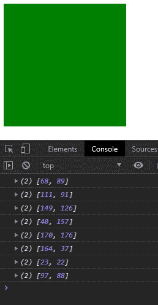
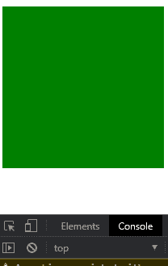
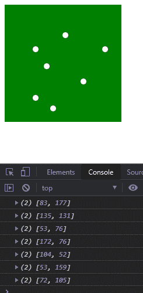

# D3.js clientPoint()功能

> 原文:[https://www.geeksforgeeks.org/d3-js-clientpoint-function/](https://www.geeksforgeeks.org/d3-js-clientpoint-function/)

**d3.clientPoint()** 用于返回附加到特定容器或 HTML 标签的特定事件的 x 坐标和 y 坐标。

**语法:**

```
d3.clientPoint(container, event);

```

**参数:**该函数接受两个参数，如上所述，如下所述。

*   **容器:**容器可以是 HTML 或 SVG 容器。
*   **事件:**事件可以是触摸、点击、悬停等任何事件。

**返回值:**返回坐标 x 和 y 的数组。

下面的例子说明了 JavaScript 中的 D3.js clientPoint()函数

**示例 1:**

## 超文本标记语言

```
<!DOCTYPE html>
<html lang="en">
    <head>
        <meta charset="UTF-8" />
        <meta
            name="viewport"
            path1tent="width=device-width, 
                       initial-scale=1.0"/>
        <title>D3.js clientPoint() Function</title>
    </head>
    <style>
        div {
            width: 200px;
            height: 200px;
            background-color: green;
        }
    </style>
    <body>
        <div></div>
        <script src=
"https://d3js.org/d3.v4.min.js">
        </script>
        <script src=
"https://d3js.org/d3-selection.v1.min.js">
        </script>
        <script>
            let btn = document.querySelector("div");
            btn.addEventListener("click", createDot);
            var div = d3.select("div").node();
            function createDot(event) {
                let pos = d3.clientPoint(div, event);
                console.log(pos);
            }
        </script>
    </body>
</html>
```

**输出:**点击绿色方框后，输出出现在控制台窗口中。



**示例 2:** 在曾经发生点击事件的地方创建白点。

## 超文本标记语言

```
<!DOCTYPE html>
<html lang="en">
    <head>
        <meta charset="UTF-8" />
        <meta
            name="viewport"
            path1tent="width=device-width, 
                       initial-scale=1.0"/>
        <title>D3.js clientPoint() Function</title>
    </head>
    <style>
        svg {
            width: 200px;
            height: 200px;
            background-color: green;
        }
    </style>
    <body>
        <svg></svg>
        <script src=
"https://d3js.org/d3.v4.min.js">
        </script>
        <script src=
"https://d3js.org/d3-selection.v1.min.js">
        </script>
        <script>
            let btn = document.querySelector("svg");
            btn.addEventListener("click", createDot);
            var svg = d3.select("svg").node();
            function createDot(event) {
                let pos = d3.clientPoint(svg, event);
                console.log(pos);
                d3.select(svg).append("circle").attr("fill", "white")
                  .attr("r", 5).attr("cx", pos[0]).attr("cy", pos[1]);
            }
        </script>
    </body>
</html>
```

**输出:**

在单击 SVG 容器之前:



**点击 SVG 容器**后:

