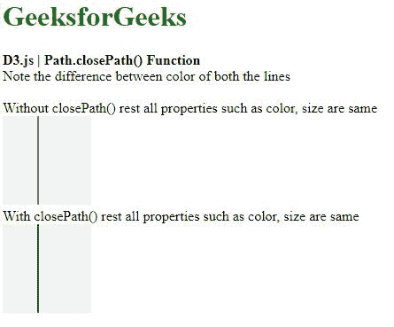
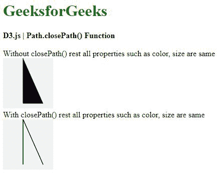

# D3.js closePath()函数

> 原文:[https://www.geeksforgeeks.org/d3-js-closepath-function/](https://www.geeksforgeeks.org/d3-js-closepath-function/)

d3.closePath()函数用于关闭当前正在进行的子路径，与 SVG 的 closePath 命令几乎相同。

**语法:**

```
d3.closePath()
```

**参数:**不接受任何参数。

**返回值:**不返回值。

**例 1:**

## 超文本标记语言

```
<!DOCTYPE html>
<html lang="en">

<head>
    <meta charset="UTF-8">
    <meta name="viewport" path1tent=
        "width=device-width,initial-scale=1.0">

    <script src="https://d3js.org/d3.v4.min.js">
    </script>

    <style>
        h1 {
            color: green;
        }

        svg {
            background-color: #f2f2f2;
        }

        .path1,
        .path2 {
            stroke: #000;
        }
    </style>
</head>

<body>
    <div>
        <h1>GeeksforGeeks</h1>
        <b>D3.js | Path.closePath() Function</b>
        <br>
        Note the difference between 
        color of both the lines
        <br><br>
        Without closePath() rest all properties 
        such as color, size are same <br>

        <svg width="100" height="100">
            <path class="path1">
        </svg> <br>

        With closePath() rest all properties 
        such as color, size are same <br>
        <svg width="100" height="100">
            <path class="path2">
        </svg>
    </div>

    <script>

        // Creating a path 
        var path1 = d3.path();
        path1.moveTo(40, 0);

        // Making line to x:0 and y:100 
        path1.lineTo(40, 100);
        d3.select(".path1").attr("d", path1);

        // Creating a path 
        var path1 = d3.path();
        path1.moveTo(40, 0);

        // Making line to x:0 and y:100 
        path1.lineTo(40, 100);

        // Closing the path 
        path1.closePath();
        d3.select(".path2").attr("d", path1); 
    </script>
</body>

</html>
```

**输出:**



**例 2:**

## 超文本标记语言

```
<!DOCTYPE html>
<html lang="en">

<head>
    <meta charset="UTF-8">
    <meta name="viewport" path1tent=
        "width=device-width,initial-scale=1.0">

    <script src=
        "https://d3js.org/d3.v4.min.js">
    </script>

    <style>
        h1 {
            color: green;
        }

        svg {
            background-color: #f2f2f2;
        }

        .path1,
        .path2 {
            stroke: #000;
        }
    </style>
</head>

<body>
    <div>
        <h1>GeeksforGeeks</h1>
        <b>D3.js | Path.closePath() Function</b>
        <br><br>
        Without closePath() rest all properties 
        such as color, size are same <br>
        <svg width="100" height="100">
            <path class="path1">
        </svg> <br>
        With closePath() rest all properties 
        such as color, size are same <br>
        <svg width="100" height="100">
            <path class="path2">
        </svg>
    </div>

    <script>

        // Creating a path 
        var path1 = d3.path();
        path1.moveTo(40, 0);

        // Making line to x:40 and y:100 
        path1.lineTo(40, 90);

        // Making line to x:80 and y:100 
        path1.lineTo(80, 90);
        d3.select(".path1").attr("d", path1);

        // Creating a path 
        var path1 = d3.path();
        path1.moveTo(40, 0);

        // Making line to x:40 and y:100 
        path1.lineTo(40, 90);

        // Closing the path 
        path1.closePath();

        // Making line to x:80 and y:100 
        path1.lineTo(80, 90);

        // Closing the path 
        path1.closePath();
        d3.select(".path2").attr("d", path1); 
    </script>
</body>

</html>
```

**输出:**

