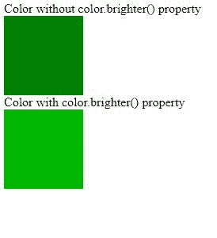
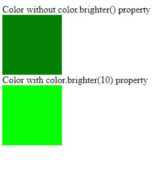
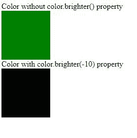

# D3.js color.brighter()功能

> 原文:[https://www . geesforgeks . org/D3-js-color-brighter-function/](https://www.geeksforgeeks.org/d3-js-color-brighter-function/)

D3.js 的 **color.brighter()** 功能是在原颜色的基础上，用一些额外的亮度或暗度来复制颜色。

**语法:**

```
color.brighter(k)

```

**参数:**该功能只接受一个参数 k 即原颜色所需的亮度大小。它是整数值。

**返回值:**返回对象。

**例 1:** 未给出 k 值时

## 超文本标记语言

```
<!DOCTYPE html>
<html lang="en">
    <head>
        <meta charset="UTF-8" />
        <meta
            name="viewport"
            content="width=device-width, 
                     initial-scale=1.0"/>
        <title>D3.js color.brighter() Function</title>
    </head>
    <style>
        .box {
            height: 100px;
            width: 100px;
        }
        .box1 {
            height: 100px;
            width: 100px;
        }
    </style>
    <body>
        Color without color.brighter() property
        <div class="box"></div>
        Color with color.brighter() property
        <div class="box1"></div>
        <!--fetching from CDN of D3.js -->
        <script type="text/javascript" src=
                "https://d3js.org/d3.v4.min.js">
        </script>
        <script>
            let box = document.querySelector(".box");
            let box1 = document.querySelector(".box1");
            var color = d3.color("green");
            box.style.backgroundColor = 
              `rgb(${color.r},${color.g},${color.b})`;
            var color = color.brighter();
            box1.style.backgroundColor = 
              `rgb(${color.r},${color.g},${color.b})`;
        </script>
    </body>
</html>
```

**输出:**



**例 2:**

## 超文本标记语言

```
<!DOCTYPE html>
<html lang="en">
    <head>
        <meta charset="UTF-8" />
        <meta name="viewport"
              content="width=device-width, 
                       initial-scale=1.0" />
        <title>D3.js color.brighter() Function</title>
    </head>
    <style>
        .box {
            height: 100px;
            width: 100px;
        }
        .box1 {
            height: 100px;
            width: 100px;
        }
    </style>
    <body>
        Color without color.brighter() property
        <div class="box"></div>
        Color with color.brighter(10) property
        <div class="box1"></div>
        <!--fetching from CDN of D3.js -->
        <script type="text/javascript" src=
                "https://d3js.org/d3.v4.min.js">
        </script>
        <script>
            let box = document.querySelector(".box");
            let box1 = document.querySelector(".box1");
            var color = d3.color("green");
            box.style.backgroundColor = 
              `rgb(${color.r},${color.g},${color.b})`;
            var color = color.brighter(10);
            box1.style.backgroundColor = 
              `rgb(${color.r},${color.g},${color.b})`;
        </script>
    </body>
</html>
```

**输出:**



**例 3:** 当 k 值<为 0 时

## 超文本标记语言

```
<!DOCTYPE html>
<html lang="en">
    <head>
        <meta charset="UTF-8" />
        <meta name="viewport" 
              content="width=device-width, 
                       initial-scale=1.0" />
        <title>D3.js color.brighter() Function</title>
    </head>
    <style>
        .box {
            height: 100px;
            width: 100px;
        }
        .box1 {
            height: 100px;
            width: 100px;
        }
    </style>
    <body>
        Color without color.brighter() property
        <div class="box"></div>
        Color with color.brighter(-10) property
        <div class="box1"></div>
        <!--fetching from CDN of D3.js -->
        <script type="text/javascript" src=
                "https://d3js.org/d3.v4.min.js">
        </script>
        <script>
            let box = document.querySelector(".box");
            let box1 = document.querySelector(".box1");
            var color = d3.color("green");
            box.style.backgroundColor = 
              `rgb(${color.r},${color.g},${color.b})`;
            var color = color.brighter(-10);
            box1.style.backgroundColor =
              `rgb(${color.r},${color.g},${color.b})`;
        </script>
    </body>
</html>
```

**输出:**

