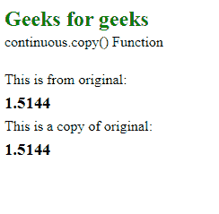
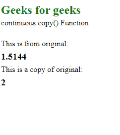

# D3.js continuous.copy()函数

> 原文:[https://www . geesforgeks . org/D3-js-continuous-copy-function/](https://www.geeksforgeeks.org/d3-js-continuous-copy-function/)

**continuous.copy()** 函数用于创建并返回给定比例的精确副本。原始比例的任何变化都不会影响返回比例，反之亦然。

**语法:**

```
continuous.copy();
```

**参数:**此功能不接受任何参数。

**返回值:**该函数返回原始刻度的副本。

下面的例子说明了 D3.js 中的 continuous.copy()函数:

**例 1:**

## 超文本标记语言

```
<!DOCTYPE html>
<html lang="en">

<head>
    <meta charset="UTF-8"/>
    <meta name="viewport" path1tent=
        "width=device-width, initial-scale=1.0"/>
    <script src="https://d3js.org/d3.v4.min.js">
    </script>
    <script src=
    "https://d3js.org/d3-color.v1.min.js">
    </script>
    <script src=
    "https://d3js.org/d3-interpolate.v1.min.js">
    </script>
    <script src=
    "https://d3js.org/d3-scale-chromatic.v1.min.js">
    </script>
</head>

<body>
    <h2 style="color:green;">Geeks for geeks</h2>

    <p>continuous.copy() Function </p>

    <script>
        var x = d3.scaleLinear()
            .domain([0, 1])
            .range([1, 2, 3, 4, 5, 6])

        var copy = x.copy();
        document.write("</br>");
        document.write("<p> This is from original: ");
        document.write("<h3>" + x(0.5144) + "</h3>");
        document.write("<p> This is a copy of original: ");
        document.write("<h3>" + copy(0.5144) + "</h3>");
    </script>
</body>

</html>
```

**输出:**



**例 2:**

## 超文本标记语言

```
<!DOCTYPE html>
<html lang="en">

<head>
    <meta charset="UTF-8" />
    <meta name="viewport" path1tent="width=device-width, 
        initial-scale=1.0" />
    <title>Geeks for geeks</title>
    <script src="https://d3js.org/d3.v4.min.js">
    </script>
    <script src="https://d3js.org/d3-color.v1.min.js">
    </script>
    <script src=
    "https://d3js.org/d3-interpolate.v1.min.js">
    </script>
    <script src=
    "https://d3js.org/d3-scale-chromatic.v1.min.js">
    </script>
</head>

<body>
    <h2>Geeks for geeks</h2>

    <p>continuous.copy() Function </p>

    <script>
        var x = d3.scaleLinear()
            .domain([0, 1])
            .range([1, 2, 3, 4, 5, 6])

        var copy = x.copy()
            .interpolate(d3.interpolateRound);

        document.write("</br>");
        document.write("This is from original: ");
        document.write("<h3>" + x(0.5144) + "</h3>");
        document.write("This is a copy of original: ");
        document.write("<h3>" + copy(0.5144) + "</h3>");
    </script>
</body>

</html>
```

**输出:**

