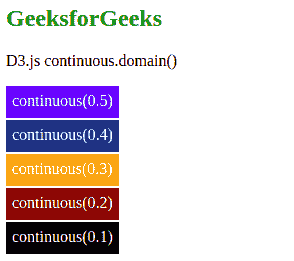

# D3.js continuous.domain()函数

> 原文:[https://www . geesforgeks . org/D3-js-continuous-domain-function/](https://www.geeksforgeeks.org/d3-js-continuous-domain-function/)

**continuous.domain()** 函数用于将标尺的定义域设置为指定的数字数组。此处指定的数组包含两个或两个以上的元素。

**语法:**

```
continuous.domain([domain]);

```

**参数:**该函数接受单个参数，如上所述，如下所述。

*   **【域】:**这是一个数组，采用两个或多个指定域的值。

**返回值:**这个函数不返回任何东西。

下面的例子说明了 JavaScript 中的 D3.js continuous.domain()函数:

**例 1:**

## 超文本标记语言

```
<!DOCTYPE html> 
<html lang="en"> 
<head> 
    <meta charset="UTF-8" /> 
    <meta name="viewport"
        path1tent="width=device-width, 
        initial-scale=1.0"/> 
    <script src=
"https://d3js.org/d3.v4.min.js">
    </script> 
    <script src=
"https://d3js.org/d3-color.v1.min.js">
    </script> 
    <script src=
"https://d3js.org/d3-interpolate.v1.min.js">
    </script> 
    <script src=
"https://d3js.org/d3-scale-chromatic.v1.min.js">
    </script> 
</head> 
<body style="text-align: center;"> 
    <h2 style="color: green;">
        Geeksforgeeks
    </h2>

    <p>D3.js continuous.domain() Function </p>

    <script> 
    var object = d3.scaleLinear()
                // Domain ranges 0 to 1
                    .domain([0, 1])
                    .range(["red", "green"]);
    document.write("<br/>")
    document.write("<h4>"+object(0)+"</h4>");
    document.write("<h4>"+object(1)+"</h4>");
    </script> 
</body> 
</html>    
```

**输出:** 

**例 2:**

## 超文本标记语言

```
<!DOCTYPE html>
<html lang="en">
    <head>
        <meta charset="UTF-8" />
        <meta name="viewport"
              content="width=device-width, 
                       initial-scale=1.0"/>
    </head>
    <style>
        div {
            padding: 6px;
            text-align: center;
            vertical-align: middle;
            display: flex;
            justify-content: center;
            color: White;
            width: fit-content;
            margin-top: 2px;
            height: 20px;
        }
    </style>
    <body>
        <h2 style="color: green;">
            GeeksforGeeks
        </h2>
        <p>D3.js continuous.domain()</p>
        <div class="box1">
            <span>continuous(0.5)</span>
        </div>
        <div class="box2">
            <span>continuous(0.4)</span>
        </div>
        <div class="box3">
            <span>continuous(0.3)</span>
        </div>
        <div class="box4">
            <span>continuous(0.2)</span>
        </div>
        <div class="box5">
            <span>continuous(0.1)</span>
        </div>
        <!--Fetching from CDN of D3.js -->
        <script src=
"https://d3js.org/d3.v4.min.js">
         </script>
        <script src=
"https://d3js.org/d3-color.v1.min.js">
         </script>
        <script src=
"https://d3js.org/d3-interpolate.v1.min.js">
         </script>
        <script src=
"https://d3js.org/d3-scale-chromatic.v1.min.js">
         </script>
        <script>
            var continuous = d3
                .scaleLinear()
                // Domain ranges 0 to 1
                .domain([-2, -1, 0, 1, 2])
                .range(["Blue", "green", "orange",
                        "Red", "black"]);
            let color1 = continuous(-2);
            let color2 = continuous(-1.5);
            let color3 = continuous(0);
            let color4 = continuous(1.5);
            let color5 = continuous(2);

            // Selecting Div using query selector
            let box1 = document.querySelector(".box1");
            let box2 = document.querySelector(".box2");
            let box3 = document.querySelector(".box3");
            let box4 = document.querySelector(".box4");
            let box5 = document.querySelector(".box5");

            // Setting style and BG color of 
            // the particular DIVs
            box1.style.backgroundColor = color1;
            box2.style.backgroundColor = color2;
            box3.style.backgroundColor = color3;
            box4.style.backgroundColor = color4;
            box5.style.backgroundColor = color5;
        </script>
    </body>
</html>
```

**输出:** 