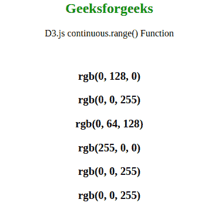
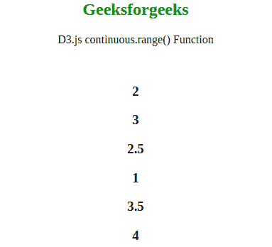

# D3.js continuous.range()函数

> 原文:[https://www . geesforgeks . org/D3-js-continuous-range-function/](https://www.geeksforgeeks.org/d3-js-continuous-range-function/)

d3.js 中的 **continuous.range()** 函数用于将刻度范围设置为指定的值数组，该数组必须包含两个或两个以上的值。范围内的元素可以是数字或字符串。

**语法:**

```
continuous.range([range]);
```

**参数:**该函数接受一个参数，如上所述，如下所述。

*   **【范围】:**这是一个包含指定域范围的数组。

**返回值:**这个函数不返回任何东西。

下面的示例说明了 JavaScript 中的 D3.js continuous.range()函数:

**示例 1:** 当范围数组是一串颜色时。

## 超文本标记语言

```
<!DOCTYPE html>
<!DOCTYPE html>
<html lang="en">
<head>
    <meta charset="UTF-8" />
    <meta name="viewport"
          path1tent="width=device-width,
                     initial-scale=1.0"/>
    <script src=
"https://d3js.org/d3.v4.min.js">
    </script>
    <script src=
"https://d3js.org/d3-color.v1.min.js">
    </script>
    <script src=
"https://d3js.org/d3-interpolate.v1.min.js">
    </script>
    <script src=
"https://d3js.org/d3-scale-chromatic.v1.min.js">
    </script>
</head>
<body style ="text-align: center">
    <h2 style="color: green;">Geeksforgeeks</h2>

<p>D3.js continuous.range() Function </p>

    <script>
    var continuous = d3.scaleLinear()
                // Domain ranges -1, 0, 1
                    .domain([-1, 0, 1])
                // Range for the domain
                    .range(["red", "green", "blue"]);

    document.write("<br/>")
    document.write("<h3>"+continuous(0)+"</h3>");
    document.write("<h3>"+continuous(1)+"</h3>");
    document.write("<h3>"+continuous(0.5)+"</h3>");
    document.write("<h3>"+continuous(-1)+"</h3>");

    // Out of domain values
    document.write("<h3>"+continuous(1.5)+"</h3>");
    document.write("<h3>"+continuous(2)+"</h3>");
    </script>
</body>
</html>   
```

**输出:**



**例 2:** 当范围数组为数字类型时。

## 超文本标记语言

```
<!DOCTYPE html>
<html lang="en">
<head>
    <meta charset="UTF-8" />
    <meta name="viewport"
          path1tent="width=device-width,
                     initial-scale=1.0"/>
    <script src=
"https://d3js.org/d3.v4.min.js">
    </script>
    <script src=
"https://d3js.org/d3-color.v1.min.js">
    </script>
    <script src=
"https://d3js.org/d3-interpolate.v1.min.js">
    </script>
    <script src=
"https://d3js.org/d3-scale-chromatic.v1.min.js">
    </script>
</head>
<body style ="text-align: center">
    <h2 style="color: green;">Geeksforgeeks</h2>

<p>D3.js continuous.range() Function </p>

    <script>
    var continuous = d3.scaleLinear()
                // Domain ranges -1, 0, 1
                    .domain([-1, 0, 1])
                // Range for the domain
                    .range([1,2,3,4,5,6,7,8,9]);

    document.write("<br/>")
    document.write("<h3>"+continuous(0)+"</h3>");
    document.write("<h3>"+continuous(1)+"</h3>");
    document.write("<h3>"+continuous(0.5)+"</h3>");
    document.write("<h3>"+continuous(-1)+"</h3>");
    document.write("<h3>"+continuous(1.5)+"</h3>");
    document.write("<h3>"+continuous(2)+"</h3>");
    </script>
</body>
</html>
```

**输出:**

