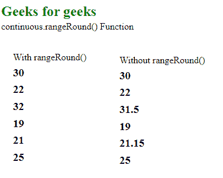
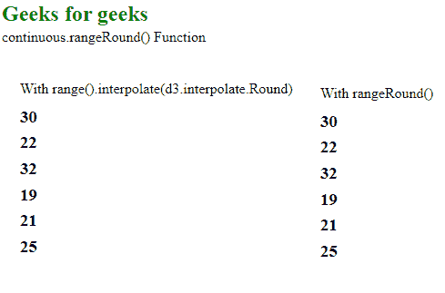

# D3.js continuous.rangeRound()函数

> 原文:[https://www . geesforgeks . org/D3-js-continuous-range round-function/](https://www.geeksforgeeks.org/d3-js-continuous-rangeround-function/)

**continuous.rangeRound()** 功能用于将刻度范围设置为指定的值数组。它还将插值器设置为插值或环绕。舍入插值器对于避免抗混叠伪像可能很有用。

**语法:**

```
continuous.rangeRound( [range] )
```

**参数:**该函数接受一个参数，如上所述，如下所述。

*   **【范围】:**是包含指定域范围的数组。

**返回值:**这个函数不返回任何东西。

下面的程序说明了 D3.js 中的 **continuous.rangeRound()** 函数:

**例 1:**

## 超文本标记语言

```
<!DOCTYPE html>
<html lang="en">

<head>
    <meta charset="UTF-8" />
    <meta name="viewport" content=
        "width=device-width,initial-scale=1.0"/>
    <script src="https://d3js.org/d3.v4.min.js">
    </script>
    <script src="https://d3js.org/d3-color.v1.min.js">
    </script>
    <script src=
    "https://d3js.org/d3-interpolate.v1.min.js">
    </script>
    <script src=
    "https://d3js.org/d3-scale-chromatic.v1.min.js">
    </script>
</head>

<body>
    <h2 style="color: green;">Geeksforgeeks</h2>

    <p>continuous.rangeRound() Function </p>

    <script>
        var continuous = d3.scaleLinear()
            // Domain ranges -10, 0, 10
            .domain([-10, 0, 10])
            // Range for the domain
            .rangeRound([10, 20, 30, 40, 
                    50, 60, 70, 80, 90]);

        document.write("<br/><div>");
        document.write("<p> With rangeRound()");
        document.write("<h3>" + continuous(10) + "</h3>");
        document.write("<h3>" + continuous(2) + "</h3>");
        document.write("<h3>" + continuous(11.5) + "</h3>");
        document.write("<h3>" + continuous(-1) + "</h3>");
        document.write("<h3>" + continuous(1.15) + "</h3>");
        document.write("<h3>" + continuous(5) + "</h3></div>");

        var continuous = d3.scaleLinear()

            // Domain ranges -10, 0, 10
            .domain([-10, 0, 10])
            // Range for the domain
            .range([10, 20, 30, 40, 50, 60, 70, 80, 90])

        document.write("<br/><div>");
        document.write("<p> Without rangeRound()");
        document.write("<h3>" + continuous(10) + "</h3>");
        document.write("<h3>" + continuous(2) + "</h3>");
        document.write("<h3>" + continuous(11.5) + "</h3>");
        document.write("<h3>" + continuous(-1) + "</h3>");
        document.write("<h3>" + continuous(1.15) + "</h3>");
        document.write("<h3>" + continuous(5) + "</h3></div>");
    </script>
</body>

</html>
```

**输出:**

[](https://media.geeksforgeeks.org/wp-content/uploads/20200818092446/019.png)

**例 2:**

## 超文本标记语言

```
<!DOCTYPE html>
<html lang="en">

<head>
    <meta charset="UTF-8" />
    <meta name="viewport" content="width=device-width, 
                   initial-scale=1.0" />
    <script src="https://d3js.org/d3.v4.min.js">
    </script>
    <script src="https://d3js.org/d3-color.v1.min.js">
    </script>
    <script src=
    "https://d3js.org/d3-interpolate.v1.min.js">
    </script>
    <script src=
    "https://d3js.org/d3-scale-chromatic.v1.min.js">
    </script>

    <style>
        div {
            line-height: 15px;
            float: left;
            padding: 10px;
            word-wrap: break-word;
            margin-left: 10px;
            height: 200px;
            width: 300px;
        }
    </style>
</head>

<body>
    <h2 style="color:green;">Geeks for geeks</h2>

    <p>continuous.rangeRound() Function </p>

    <script>
        var continuous = d3.scaleLinear()
            // Domain ranges -10, 0, 10
            .domain([-10, 0, 10])
            // Range for the domain
            .range([10, 20, 30, 40, 50, 60, 70, 80, 90])
            .interpolate(d3.interpolateRound);

        document.write("<br/><div>");
        document.write(
            "<p> With range().interpolate(d3.interpolate.Round)");
        document.write("<h3>" + continuous(10) + "</h3>");
        document.write("<h3>" + continuous(2) + "</h3>");
        document.write("<h3>" + continuous(11.5) + "</h3>");
        document.write("<h3>" + continuous(-1) + "</h3>");
        document.write("<h3>" + continuous(1.15) + "</h3>");
        document.write("<h3>" + continuous(5) + "</h3></div>");

        var continuous = d3.scaleLinear()
            // Domain ranges -10, 0, 10
            .domain([-10, 0, 10])
            // Range for the domain
            .rangeRound([10, 20, 30, 40, 50, 60, 70, 80, 90])

        document.write("<br/><div>");
        document.write("<p> With rangeRound()");
        document.write("<h3>" + continuous(10) + "</h3>");
        document.write("<h3>" + continuous(2) + "</h3>");
        document.write("<h3>" + continuous(11.5) + "</h3>");
        document.write("<h3>" + continuous(-1) + "</h3>");
        document.write("<h3>" + continuous(1.15) + "</h3>");
        document.write("<h3>" + continuous(5) + "</h3></div>");
    </script>
</body>

</html>
```

**输出:**

