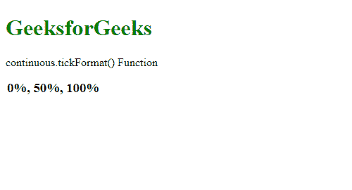
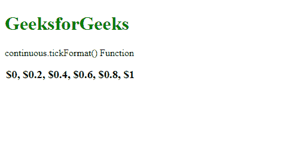

# D3.js continuous.tickFormat()函数

> 原文:[https://www . geesforgeks . org/D3-js-continuous-tick format-function/](https://www.geeksforgeeks.org/d3-js-continuous-tickformat-function/)

**continuous.tickFormat()** 功能用于更改刻度值的格式。它返回一个适合显示刻度值的数字格式函数。

**语法:**

```
continuous.tickFormat( count, specifier )
```

**参数:**该函数接受两个参数，如上所述，如下所述。

*   **计数:**是要使用的刻度值的数量。这是一个可选参数。
*   **说明符:**是指定要使用的格式的字符串。这是一个可选参数。

**返回值:**这个函数不返回任何东西。

下面的程序说明了 D3.js 中的 **continuous.tickFormat()** 函数:

**例 1:**

## 超文本标记语言

```
<!DOCTYPE html>
<html>

<head>
    <script src="https://d3js.org/d3.v4.min.js">
    </script>
    <script src=
        "https://d3js.org/d3-color.v1.min.js">
    </script>
    <script src=
        "https://d3js.org/d3-interpolate.v1.min.js">
    </script>
    <script src=
    "https://d3js.org/d3-scale-chromatic.v1.min.js">
    </script>
</head>

<body>
    <h1 style="color: green">
        GeeksforGeeks
    </h1>

    <p>continuous.tickFormat() Function </p>

    <script>
        var x = d3.scaleLinear()
            .domain([0, 1])
            .range([1, 2, 3, 4, 5, 6]);

        var ticks = x.ticks(3)
        var tickFormat = x.tickFormat(3, " %");

        document.write("<h3>" +
            ticks.map(tickFormat) +
            "</h3>");
    </script>
</body>

</html>
```

**输出:**



**例 2:**

## 超文本标记语言

```
<!DOCTYPE html>
<html>

<head>
    <script src="https://d3js.org/d3.v4.min.js">
    </script>
    <script src=
        "https://d3js.org/d3-color.v1.min.js">
    </script>
    <script src=
        "https://d3js.org/d3-interpolate.v1.min.js">
    </script>
    <script src=
    "https://d3js.org/d3-scale-chromatic.v1.min.js">
    </script>
</head>

<body>
    <h1 style="color: green">
        GeeksforGeeks
    </h1>

    <p>continuous.tickFormat() Function </p>

    <script>
        var x = d3.scaleLinear()
            .domain([0, 1])
            .range(["red", "blue", "green", "orange"]);

        var ticks = x.ticks(5)
        var tickFormat = x.tickFormat(5, " {content}quot;);

        document.write("<h3>" +
            ticks.map(tickFormat) +
            "</h3>")
    </script>
</body>

</html>
```

**输出:**

