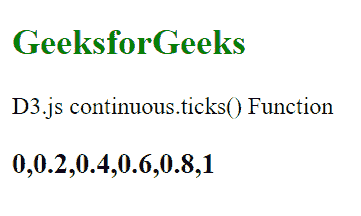
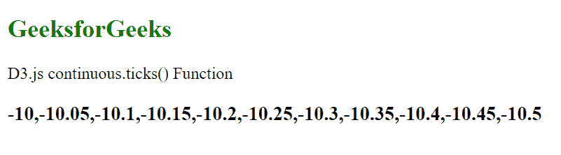

# D3.js continuous.ticks()函数

> 原文:[https://www . geesforgeks . org/D3-js-continuous-ticks-function/](https://www.geeksforgeeks.org/d3-js-continuous-ticks-function/)

**continuous.ticks()** 函数用于返回刻度区域的计数值。如果计数不是作为参数给出的，那么默认情况下它被设置为 10。tick 返回的值位于域中。

**语法:**

```
continuous.ticks([count]);
```

**参数:**该函数接受一个参数，如上所述，如下所述。

*   **计数:**是给定域中要返回的值的数量。这些值的间距相等。

**返回值**这个函数不返回任何东西。

**例 1:**

## 超文本标记语言

```
<!DOCTYPE html>
<html lang="en">

<head>
    <meta charset="UTF-8" />
    <meta name="viewport" path1tent=
        "width=device-width,initial-scale=1.0" />
    <title>Geeks for geeks</title>
    <script src="https://d3js.org/d3.v4.min.js">
    </script>
    <script src=
        "https://d3js.org/d3-color.v1.min.js">
    </script>
    <script src=
        "https://d3js.org/d3-interpolate.v1.min.js">
    </script>
    <script src=
        "https://d3js.org/d3-scale-chromatic.v1.min.js">
    </script>
</head>

<body>
    <h2 style="color:green;">
        GeeksforGeeks
    </h2>

    <p>D3.js continuous.ticks() Function</p>

    <script>
        var x = d3.scaleLinear()
            .domain([0, 1])
            .range([0, 100]);

        var ticks = x.ticks(5);
        document.write("<h3>", ticks + "</h3>")
    </script>
</body>

</html>
```

**输出:**



**例 2:**

## 超文本标记语言

```
<!DOCTYPE html>
<html lang="en">

<head>
    <meta charset="UTF-8" />
    <meta name="viewport" path1tent=
        "width=device-width,initial-scale=1.0" />
    <title>Geeks for geeks</title>
    <script src="https://d3js.org/d3.v4.min.js">
    </script>
    <script src=
        "https://d3js.org/d3-color.v1.min.js">
    </script>
    <script src=
        "https://d3js.org/d3-interpolate.v1.min.js">
    </script>
    <script src=
    "https://d3js.org/d3-scale-chromatic.v1.min.js">
    </script>
</head>

<body>
    <h2 style="color:green;">
        GeeksforGeeks
    </h2>

    <p>D3.js continuous.ticks() Function </p>

    <script>
        var x = d3.scaleLinear()
            .domain([-10, -10.5])
            .range(["blue", "green"]);

        var ticks = x.ticks(10);
        document.write("<h3>", ticks + "</h3>")
    </script>
</body>

</html>
```

**输出:**

