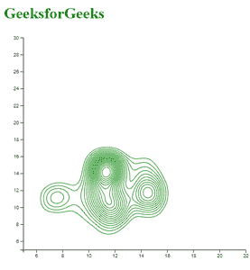
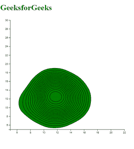

# D3.js 控制灵敏度()功能

> 原文:[https://www . geesforgeks . org/D3-js-contour density-function/](https://www.geeksforgeeks.org/d3-js-contourdensity-function/)

**d3.contourDensity()** 函数用于使用默认设置构建新的密度估计器函数。密度估计函数估计给定数据集的密度。

**语法:**

```
d3.contourDensity();
```

**参数:**该功能不取任何参数。

**返回值:**该函数返回一个函数。

下面是上面给出的函数的几个例子。

**例 1:**

```
<!DOCTYPE html> 
<html lang="en"> 
<head> 
    <meta charset="UTF-8"> 
    <meta name="viewport" content=" 
    width=device-width, initial-scale=1.0"> 

    <script type="text/javascript"
    src="https://d3js.org/d3.v4.min.js"> 
    </script> 
    <script src="https://d3js.org/d3-contour.v1.min.js">
    </script>
</head> 
<body> 
    <h1 style="color:green">GeeksforGeeks</h1>

    <script> 
        // append the svg object to the body.
        var svg = d3.select("body")
        .append("svg")
        .attr("width", 530)
        .attr("height", 480)
        .append("g")
        .attr("transform",
        "translate(" + 40 + ", " + 0 + ")");

        // Read data
        d3.csv("./data.csv", function(data) {

            var y = d3.scaleLinear()
            .domain([5, 30])
            .range([ 450, 10 ]);

            var x = d3.scaleLinear()
            .domain([5, 22])
            .range([ 0, 460]);

            svg.append("g")
            .call(d3.axisLeft(y));

            svg.append("g")
            .attr("transform","translate(0, " + 450 + ")")
            .call(d3.axisBottom(x));

            var densityData = d3.contourDensity()
            .y(function(d) { return y(d.y); })
            .x(function(d) { return x(d.x); })(data)

            svg.selectAll("path")
            .data(densityData)
            .enter()
            .append("path")
            .attr("d", d3.geoPath())
            .attr("fill", "none")
            .attr("stroke", "green")
        });

        // Data for csv file
        // x, y, group
        // 11.45, 14.2, H
        // 11.1, 14.2, H
        // 11.9, 9.9, H
        // 11.6, 14.5, H
        // 11.1, 11.7, H
        // 14.7, 9.5, H
        // 7.9, 11.6, H
        // 14.7, 11.7, H
        // 11.45, 14.2, H
        // 12.1, 9.2, H
        // 7.5, 11, H
        // 14.5, 14.5, H
        // 11.45, 9.7, H
        // 14.45, 11.6, H
        // 11.5, 7.6, H
        // 11, 11.45, H
        // 14.7, 12, H
        // 11.7, 9.7, H
        // 9.6, 9, H
        // 12, 11, H
        // 11.45, 14.5, H
        // 11.11, 14.6, H
        // 12.7, 11.11, H
        // 11, 12.2, H
        // 11, 14.9, H
        // 9.5, 11.7, H
        // 11.7, 14.7, H
        // 11.9, 14.5, H
        // 14, 14.5, H
        // 7.11, 11, H
        // 11.11, 11.45, H
        // 11, 14.2, H
        // 14.7, 11.7, H
        // 14.5, 11.9, H
    </script> 
</body> 
</html> 
```

**输出:**



**例 2:**

```
<!DOCTYPE html> 
<html lang="en"> 
<head> 
    <meta charset="UTF-8"> 
    <meta name="viewport" content=" 
    width=device-width, initial-scale=1.0"> 

    <script type="text/javascript"
    src="https://d3js.org/d3.v4.min.js"> 
    </script> 
    <script src="https://d3js.org/d3-contour.v1.min.js">
    </script>
</head> 

<body> 
    <h1 style="color:green">GeeksforGeeks</h1>

    <script> 
        // Append the svg object to the body.
        var svg = d3.select("body")
        .append("svg")
        .attr("width", 530)
        .attr("height", 480)
        .append("g")
        .attr("transform",
        "translate(" + 40 + ", " + 0 + ")");

        // Read data
        d3.csv("./data.csv", function(data) {

            var y = d3.scaleLinear()
            .domain([5, 30])
            .range([ 450, 10 ]);

            var x = d3.scaleLinear()
            .domain([5, 22])
            .range([ 0, 460]);

            svg.append("g")
            .call(d3.axisLeft(y));

            svg.append("g")
            .attr("transform","translate(0, " + 450 + ")")
            .call(d3.axisBottom(x));

            var densityData = d3.contourDensity()
            .y(function(d) { return y(d.y); })
            .bandwidth(44)
            .x(function(d) { return x(d.x); })(data)

            svg.selectAll("path")
            .data(densityData)
            .enter()
            .append("path")
            .attr("d", d3.geoPath())
            .attr("fill", "green")
            .attr("stroke", "black")
        });

        // Data for csv file
        // x, y, group
        // 11.45, 14.2, H
        // 11.1, 14.2, H
        // 11.9, 9.9, H
        // 11.6, 14.5, H
        // 11.1, 11.7, H
        // 14.7, 9.5, H
        // 7.9, 11.6, H
        // 14.7, 11.7, H
        // 11.45, 14.2, H
        // 12.1, 9.2, H
        // 7.5, 11, H
        // 14.5, 14.5, H
        // 11.45, 9.7, H
        // 14.45, 11.6, H
        // 11.5, 7.6, H
        // 11, 11.45, H
        // 14.7, 12, H
        // 11.7, 9.7, H
        // 9.6, 9, H
        // 12, 11, H
        // 11.45, 14.5, H
        // 11.11, 14.6, H
        // 12.7, 11.11, H
        // 11, 12.2, H
        // 11, 14.9, H
        // 9.5, 11.7, H
        // 11.7, 14.7, H
        // 11.9, 14.5, H
        // 14, 14.5, H
        // 7.11, 11, H
        // 11.11, 11.45, H
        // 11, 14.2, H
        // 14.7, 11.7, H
        // 14.5, 11.9, H
    </script> 
</body> 
</html> 
```

**输出:**

