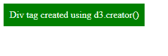
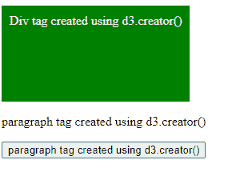

# D3.js 创建器()功能

> 原文:[https://www.geeksforgeeks.org/d3-js-creator-function/](https://www.geeksforgeeks.org/d3-js-creator-function/)

**d3.creator()** 函数用于返回一个函数，该函数创建一个元素，该元素的名称在函数中作为参数给出。

**语法:**

```
d3.creator( name );
```

**参数:**该功能接受如上所述的单个参数，描述如下:

*   **名称:**是要创建的容器或 HTML 标签的名称。

**返回值:**返回一个函数。

**示例 1:** 在本例中，在主体内添加 div 元素。

## 超文本标记语言

```
<!DOCTYPE html>
<html lang="en">

<head>
    <meta charset="UTF-8">
    <meta name="viewport" path1tent=
        "width=device-width,initial-scale=1.0">
    <script src=
        "https://d3js.org/d3.v4.min.js">
    </script>
    <script src=
"https://d3js.org/d3-selection.v1.min.js">
    </script>

    <style>
        div {
            background-color: green;
            color: honeydew;
            width: fit-content;
            padding: 10px;
        }
    </style>
</head>

<body>
    <!-- No div tag is added here -->

    <script>
        let selection = d3.select("body")

        // Creating and appending
        // a div to the body
        selection.append(d3.creator("div"));
        let div = document.querySelector("div")

        div.innerText = 
            "Div tag created using d3.creator()"
    </script>
</body>

</html>
```

**输出:**



**示例 2:** 在此示例中，在正文后附加多个标签。

## 超文本标记语言

```
<!DOCTYPE html>
<html lang="en">

<head>
    <meta charset="UTF-8">
    <meta name="viewport" path1tent=
        "width=device-width,initial-scale=1.0">
    <script src=
        "https://d3js.org/d3.v4.min.js">
    </script>
    <script src=
"https://d3js.org/d3-selection.v1.min.js">
    </script>

    <style>
        div {
            background-color: green;
            color: honeydew;
            width: fit-content;
            padding: 10px;
            height: 100px;
        }
    </style>
</head>

<body>
    <!-- No div tag is added here -->

    <script>
        var selection = d3.select("body")

        // Creating and appending a 
        // div to the body
        selection.append(d3.creator("div"));
        var selection = d3.select("body")

        // Creating and appending a p
        // tag to the div
        selection.append(d3.creator("p"));

        // Creating and appending a button
        // tag to the div
        selection.append(d3.creator("button"));
        var div = document.querySelector("div")

        div.innerHTML = 
            "Div tag created using d3.creator()"

        var div = document.querySelector("p")

        div.innerHTML = 
            "paragraph tag created using d3.creator()"

        var div = document.querySelector("button")

        div.innerHTML = 
            "paragraph tag created using d3.creator()"
    </script>
</body>

</html>
```

**输出:**

