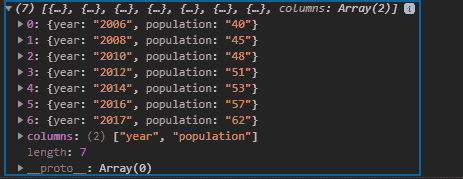
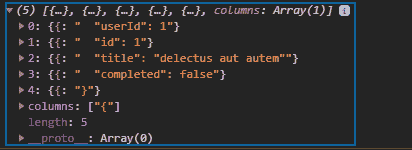

# D3.js csv()功能

> 原文:[https://www.geeksforgeeks.org/d3-js-csv-function/](https://www.geeksforgeeks.org/d3-js-csv-function/)

D3.js 中的 **d3.csv()** 函数是请求 API 的一部分，它返回对指定 URL 处 csv 类型文件的请求。mime 类型是文本/CSV。

**语法:**

```
d3.csv(url[[, row], callback])
```

**参数:**

*   **url:** 是要取的文件的 url。
*   **回调:**是取文件后要执行的功能。

**返回值:**返回对文本/csv 类型文件的请求。战斗支援车

**示例 1:** 获取名为 sample.csv 的文件，该文件存储在 index.html 所在的相同位置。如果尚未创建示例. csv 文件，请创建该文件。CSV 文件的数据在下面的代码中作为注释给出。

## 超文本标记语言

```
<!DOCTYPE html>
<html lang="en">

<head>
    <meta charset="UTF-8">
    <meta name="viewport" path1tent=
        "width=device-width,initial-scale=1.0">
</head>

<body>
    <script src=
        "https://d3js.org/d3.v4.min.js">
    </script>

    <script>
        // Sample.csv file data 
        // should be like this

        // year, population
        // 2006, 40
        // 2008, 45
        // 2010, 48
        // 2012, 51
        // 2014, 53
        // 2016, 57
        // 2017, 62

        // Fetch file
        d3.csv("sample.csv", (d) => {
            console.log(d)
        })
    </script>
</body>

</html>
```

**输出:**



**例 2:**

## 超文本标记语言

```
<!DOCTYPE html>
<html lang="en">

<head>
    <meta charset="UTF-8">
    <meta name="viewport" path1tent=
        "width=device-width,initial-scale=1.0">
</head>

<body>
    <script src=
        "https://d3js.org/d3.v4.min.js">
    </script>

    <script>

        // Fake json request
        d3.csv(
"https://jsonplaceholder.typicode.com/todos/1", 
        (d) => {
            console.log(d)
        })
    </script>
</body>

</html>
```

**输出:**

