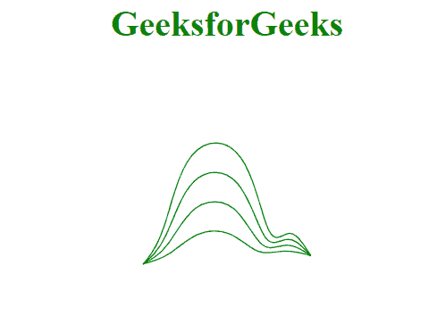
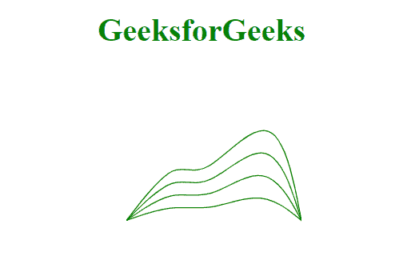

# D3 . js curve bundleβ()方法

> 原文:[https://www . geesforgeks . org/D3-js-curvebundle-beta-method/](https://www.geeksforgeeks.org/d3-js-curvebundle-beta-method/)

束曲线插值器创建拉直的 c 三次基样条。样条被拉直的程度由插值器的β值决定。有效的β值的范围在 0 和 1 之间。在极端情况下，当的β值为 1 时，曲线类似于 d3.curveBasis、产生的曲线，当的β值为 0 时，曲线是第一个和最后一个控制点之间的直线。

**语法:**

```
d3.curveBundle.beta(beta_value)

```

**参数:**

*   **β_ 值:**曲线的β值范围为[0，1]

**返回值:**此方法不返回值。

**例 1:**

## 超文本标记语言

```
<!DOCTYPE html>
<html>
<meta charset="utf-8">

<head>
    <script src=
"https://cdnjs.cloudflare.com/ajax/libs/d3/4.2.2/d3.min.js">
    </script>
</head>

<body>
    <h1 style="text-align:center; color:green;">
        GeeksforGeeks
    </h1>
    <center>
        <svg id="gfg" width="200" height="200"></svg>
    </center>

    <script>
        var data = [
            { x: 0, y: 0 },
            { x: 1, y: 3 },
            { x: 2, y: 15 },
            { x: 5, y: 15 },
            { x: 6, y: 1 },
            { x: 7, y: 5 },
            { x: 8, y: 1 }];

        var xScale = d3.scaleLinear()
            .domain([0, 8]).range([25, 175]);
        var yScale = d3.scaleLinear()
            .domain([0, 20]).range([175, 25]);

        var line = d3.line()
            .x((d) => xScale(d.x))
            .y((d) => yScale(d.y))
            .curve(d3.curveBundle.beta(.25));

        var line1 = d3.line()
            .x((d) => xScale(d.x))
            .y((d) => yScale(d.y))
            .curve(d3.curveBundle.beta(.5));

        var line2 = d3.line()
            .x((d) => xScale(d.x))
            .y((d) => yScale(d.y))
            .curve(d3.curveBundle.beta(.75));

        var line3 = d3.line()
            .x((d) => xScale(d.x))
            .y((d) => yScale(d.y))
            .curve(d3.curveBundle.beta(1));

        d3.select("#gfg")
            .append("path")
            .attr("d", line(data))
            .attr("fill", "none")
            .attr("stroke", "green");

        d3.select("#gfg")
            .append("path")
            .attr("d", line1(data))
            .attr("fill", "none")
            .attr("stroke", "green");

        d3.select("#gfg")
            .append("path")
            .attr("d", line2(data))
            .attr("fill", "none")
            .attr("stroke", "green");

        d3.select("#gfg")
            .append("path")
            .attr("d", line3(data))
            .attr("fill", "none")
            .attr("stroke", "green");
    </script>
</body>

</html>
```

**输出:**



**例 2:**

## 超文本标记语言

```
<!DOCTYPE html>
<html>
<meta charset="utf-8">

<head>
    <script src=
"https://cdnjs.cloudflare.com/ajax/libs/d3/4.2.2/d3.min.js">
    </script>
</head>

<body>
    <h1 style="text-align:center; color:green;">
        GeeksforGeeks
    </h1>
    <center>
        <svg id="gfg" width="200" height="200"></svg>
    </center>

    <script>
        var points = [
            { xpoint: 25, ypoint: 150 },
            { xpoint: 75, ypoint: 85 },
            { xpoint: 100, ypoint: 115 },
            { xpoint: 175, ypoint: 25 },
            { xpoint: 200, ypoint: 150 }];

        var Gen = d3.line()
            .x((p) => p.xpoint)
            .y((p) => p.ypoint)
            .curve(d3.curveBundle.beta(.25));

        var Gen1 = d3.line()
            .x((p) => p.xpoint)
            .y((p) => p.ypoint)
            .curve(d3.curveBundle.beta(.5));

        var Gen2 = d3.line()
            .x((p) => p.xpoint)
            .y((p) => p.ypoint)
            .curve(d3.curveBundle.beta(.75));

        var Gen3 = d3.line()
            .x((p) => p.xpoint)
            .y((p) => p.ypoint)
            .curve(d3.curveBundle.beta(1));

        d3.select("#gfg")
            .append("path")
            .attr("d", Gen(points))
            .attr("fill", "none")
            .attr("stroke", "green");

        d3.select("#gfg")
            .append("path")
            .attr("d", Gen1(points))
            .attr("fill", "none")
            .attr("stroke", "green");

        d3.select("#gfg")
            .append("path")
            .attr("d", Gen2(points))
            .attr("fill", "none")
            .attr("stroke", "green");

        d3.select("#gfg")
            .append("path")
            .attr("d", Gen3(points))
            .attr("fill", "none")
            .attr("stroke", "green");
    </script>
</body>

</html>
```

**输出:**

