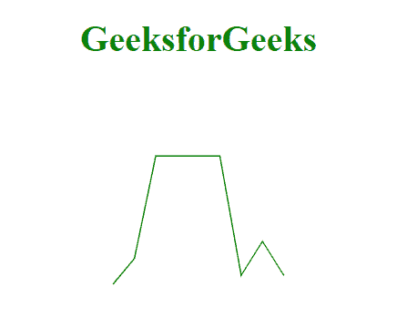

# D3.js 曲线拟合()方法

> 原文:[https://www.geeksforgeeks.org/d3-js-curvelinear-method/](https://www.geeksforgeeks.org/d3-js-curvelinear-method/)

曲线线性插值器通过选择在数据集中每对相邻点之间创建直线的点来创建多条线。当不调用 **line.curve()** 方法时，**D3 . curve line ear**插值器是默认的插值器。

**语法:**

```
d3.curveLinear()
```

**参数:**此方法不接受任何参数

**返回值:**此方法不返回值。

**例 1:**

## 超文本标记语言

```
<!DOCTYPE html>
<html>

<head>
    <meta charset="utf-8">
    <script src=
"https://cdnjs.cloudflare.com/ajax/libs/d3/4.2.2/d3.min.js">
    </script>
</head>

<body>
    <h1 style="text-align:center; color: green;">
        GeeksforGeeks</h1>
    <center>
        <svg id="gfg" width="200" height="200">
        </svg>
    </center>

    <script>
        var data = [
            { x: 0, y: 0 },
            { x: 1, y: 3 },
            { x: 2, y: 15 },
            { x: 5, y: 15 },
            { x: 6, y: 1 },
            { x: 7, y: 5 },
            { x: 8, y: 1 }];

        var xScale = d3.scaleLinear()
            .domain([0, 8]).range([25, 175]);

        var yScale = d3.scaleLinear()
            .domain([0, 20]).range([175, 25]);

        var line = d3.line()
            .x((d) => xScale(d.x))
            .y((d) => yScale(d.y))

            // curveLinear is used
            .curve(d3.curveLinear);

        d3.select("#gfg")
            .append("path")
            .attr("d", line(data))
            .attr("fill", "none")
            .attr("stroke", "green");
    </script>
</body>

</html>
```

**输出:**



**例 2:**

## 超文本标记语言

```
<!DOCTYPE html>
<html>

<head>
    <meta charset="utf-8">
    <script src="
https://cdnjs.cloudflare.com/ajax/libs/d3/4.2.2/d3.min.js">
    </script>
</head>

<body>
    <h1 style="text-align:center;color:green;">
        GeeksforGeeks</h1>
    <center>
        <svg id="gfg" width="200" height="200">
        </svg>
    </center>

    <script>
        var points = [
            { xpoint: 25, ypoint: 150 },
            { xpoint: 75, ypoint: 85 },
            { xpoint: 100, ypoint: 115 },
            { xpoint: 175, ypoint: 25 }];

        var Gen = d3.line()
            .x((p) => p.xpoint)
            .y((p) => p.ypoint)
            .curve(d3.curveLinear);

        d3.select("#gfg")
            .append("path")
            .attr("d", Gen(points))
            .attr("fill", "none")
            .attr("stroke", "green");
    </script>
</body>

</html>
```

**输出:**

